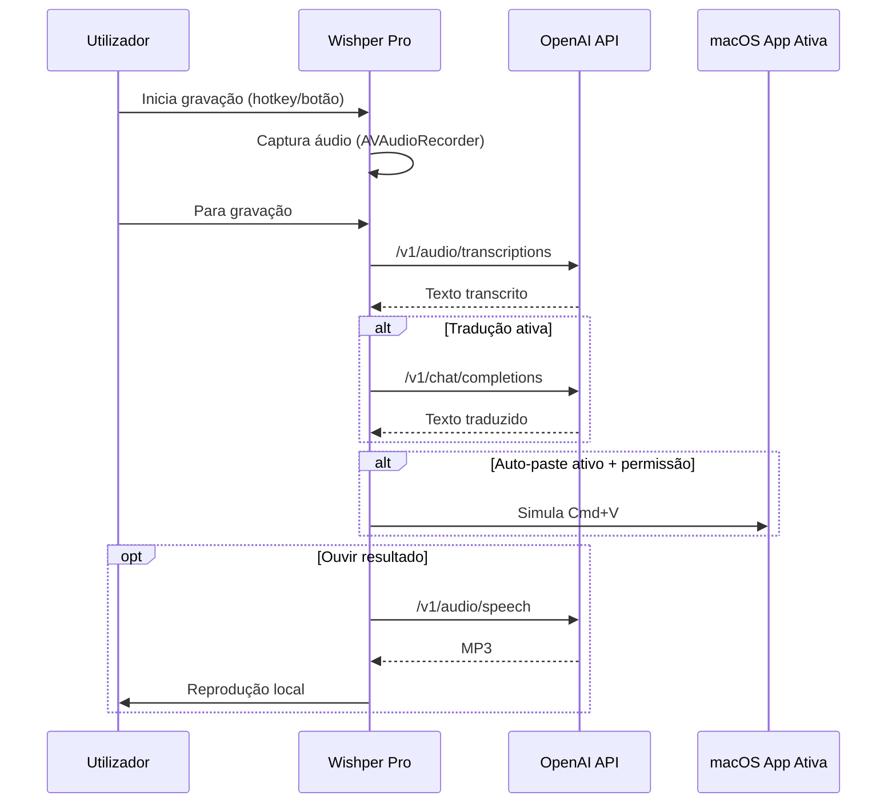

# Wishper Pro (macOS)

Aplicação nativa em Swift para ditado com OpenAI, focada em baixa latência no fluxo `falar -> transcrever -> colar`.

## Visão geral

Wishper Pro transforma voz em texto no macOS com um atalho global configurável. O foco da app é produtividade:

- iniciar/parar gravação rapidamente com push-to-talk;
- transcrever com modelos OpenAI configuráveis;
- traduzir opcionalmente o resultado;
- colar automaticamente no campo ativo da app onde estavas a escrever;
- ouvir a transcrição com TTS sem sair da interface.

Não requer login próprio, não usa base de dados local de transcrições e guarda a API key apenas no Keychain do macOS.

## Como a app funciona

### Fluxo funcional (alto nível)

1. O utilizador guarda a API key OpenAI em `Opções`.
2. A app pede permissão de microfone (quando necessário).
3. O utilizador inicia gravação com hotkey global ou botão.
4. O áudio é capturado em `m4a` temporário.
5. O ficheiro é enviado para `POST /v1/audio/transcriptions`.
6. Opcionalmente, o texto é traduzido com `POST /v1/chat/completions`.
7. Se `Auto-paste` estiver ativo e houver permissão de Acessibilidade, a app simula `Cmd+V` no campo ativo.
8. O resultado fica visível na Home, com diagnóstico técnico e opção de reproduzir áudio via `POST /v1/audio/speech`.

### Fluxo técnico (sequência)



## Funcionalidades principais

- Push-to-talk global configurável (default: `Option + Space`).
- Home com controlo rápido de gravação, estado e transcrição.
- Diagnóstico técnico por transcrição (duração, tamanho, tentativas, tempo OpenAI quando disponível).
- Tradução automática opcional (origem/destino configuráveis).
- Reprodução TTS do texto final com escolha de modelo/voz/variante de português.
- Bubble flutuante no desktop durante gravação/transcrição/reprodução.
- Armazenamento seguro da API key no Keychain.
- Persistência de preferências em `UserDefaults`.

## Arquitetura

| Componente | Responsabilidade |
| --- | --- |
| `VoicePasteViewModel` | Orquestra todo o pipeline de voz, estado de UI e configurações. |
| `AudioRecorder` | Gravação local (AAC 16 kHz mono) e medição de nível de áudio. |
| `GlobalHotkeyMonitor` | Registo e captura de hotkeys globais (Carbon + fallback). |
| `OpenAITranscriptionClient` | Integração com `/v1/audio/transcriptions` e métricas de tentativas. |
| `OpenAITranslationClient` | Integração com `/v1/chat/completions` para tradução. |
| `OpenAITTSClient` | Integração com `/v1/audio/speech` para voz sintetizada. |
| `AutoPaster` | Cola texto no campo ativo via `NSPasteboard` + evento `Cmd+V`. |
| `FloatingBubbleController` | Mostra indicador flutuante durante estados ativos. |
| `KeychainService` | Guardar/carregar/remover API key no Keychain do macOS. |

## Requisitos

- macOS 13+
- Xcode Command Line Tools (Swift 6+)
- API key da OpenAI

## Instalação

### Release local

```bash
./scripts/install-local-release.sh
```

O script:

1. compila em `release`;
2. cria bundle em `~/Applications/Wishper Pro.app`;
3. assina com certificado `Apple Development` (quando disponível);
4. abre/reinicia a app.

### Ambiente de desenvolvimento

```bash
./scripts/run-dev-app.sh
```

Este modo cria `Wishper Pro Dev.app` em `/tmp`, com `Info.plist` e assinatura, evitando limitações de interação comuns com `swift run` sem bundle app.

## Primeira configuração

1. Abrir `Opções`.
2. Inserir API key (`sk-...`) e clicar `Guardar Key`.
3. Conceder permissão de microfone quando solicitada.
4. Em `Acessibilidade`, clicar `Ativar Accessibilidade` e aprovar em:
   `Definições do Sistema > Privacidade e Segurança > Acessibilidade`.

## Como usar

1. Colocar cursor num campo de texto em qualquer app.
2. Iniciar gravação com a hotkey configurada ou botão `Iniciar Ditado`.
3. Falar.
4. Parar gravação com a mesma hotkey ou botão.
5. Aguardar transcrição (e tradução, se ativa).
6. O texto será colado automaticamente se `Auto-paste` estiver ativo.

## Atalhos

| Atalho | Ação |
| --- | --- |
| `Option + Space` (default) | Iniciar/parar gravação globalmente. |
| `Command + 1` | Ir para tab `Início`. |
| `Command + ,` | Ir para tab `Opções`. |
| `Command + Return` | Alternar gravação pelo botão principal. |
| `Esc` | Cancelar transcrição em curso. |

> O atalho push-to-talk pode ser alterado nas `Opções`.

## Configuração e persistência

### Segredos e credenciais

- API key é guardada no Keychain:
  - service: `com.wishperpro.desktop`
  - account: `openai-api-key`

### Preferências persistidas

A app guarda localmente (UserDefaults):

- hotkey personalizada;
- modelo de transcrição;
- flags e línguas de tradução;
- voz/modelo/variante de TTS.

### Defaults relevantes

- `Auto-paste`: ativo.
- Modelo de transcrição: `gpt-4o-mini-transcribe`.
- Tradução: desativada.
- Timeout de transcrição no pipeline: `30s`, sem retries automáticos (`maxRetries = 0`).

## Privacidade e segurança

- Não existe backend próprio neste projeto.
- O áudio é gravado temporariamente e removido após processamento.
- A API key não é escrita em ficheiros do repositório.
- O texto não é persistido em base de dados local.

## Troubleshooting

### "Permissão de microfone negada"

Ativar em `Definições do Sistema > Privacidade e Segurança > Microfone`.

### "Falta permissão de Acessibilidade para colar"

Ativar a app em `Definições do Sistema > Privacidade e Segurança > Acessibilidade`.

### "Não foi possível ativar o atalho..."

Hotkey em conflito com outra app ou atalho de sistema. Define outra combinação em `Opções`.

### "API key não encontrada"

Guardar novamente a key nas `Opções`. Se necessário, remover entrada antiga no Keychain e voltar a guardar.

## Estrutura do projeto

```text
Sources/WishperPro/
  ContentView.swift
  WishperProApp.swift
  VoicePasteViewModel.swift
  VoiceBubbleView.swift
  Services/
    AudioRecorder.swift
    AutoPaster.swift
    FloatingBubbleController.swift
    GlobalHotkeyMonitor.swift
    KeychainService.swift
    OpenAITranscriptionClient.swift
    OpenAITranslationClient.swift
    OpenAITTSClient.swift
    Permissions.swift
    SoundCuePlayer.swift
scripts/
  install-local-release.sh
  run-dev-app.sh
```
