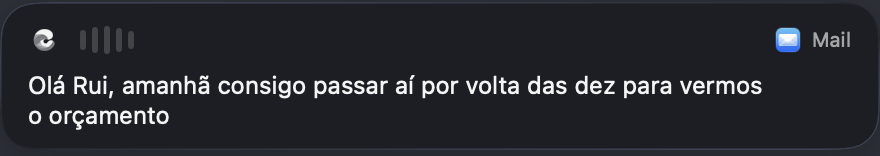
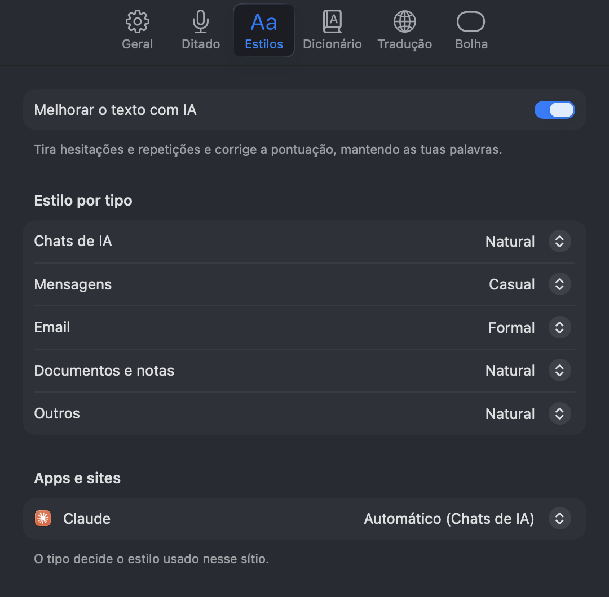
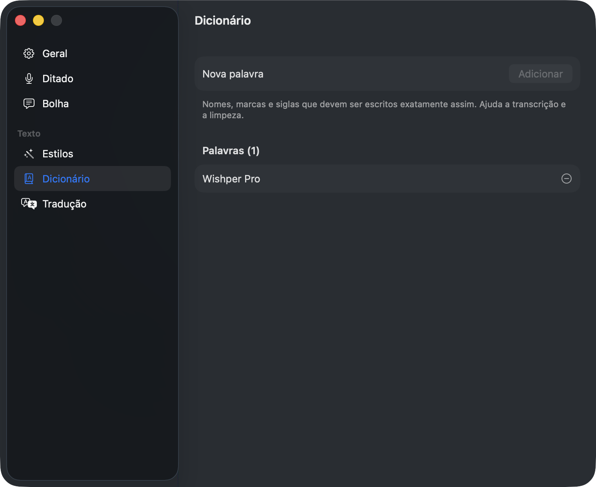
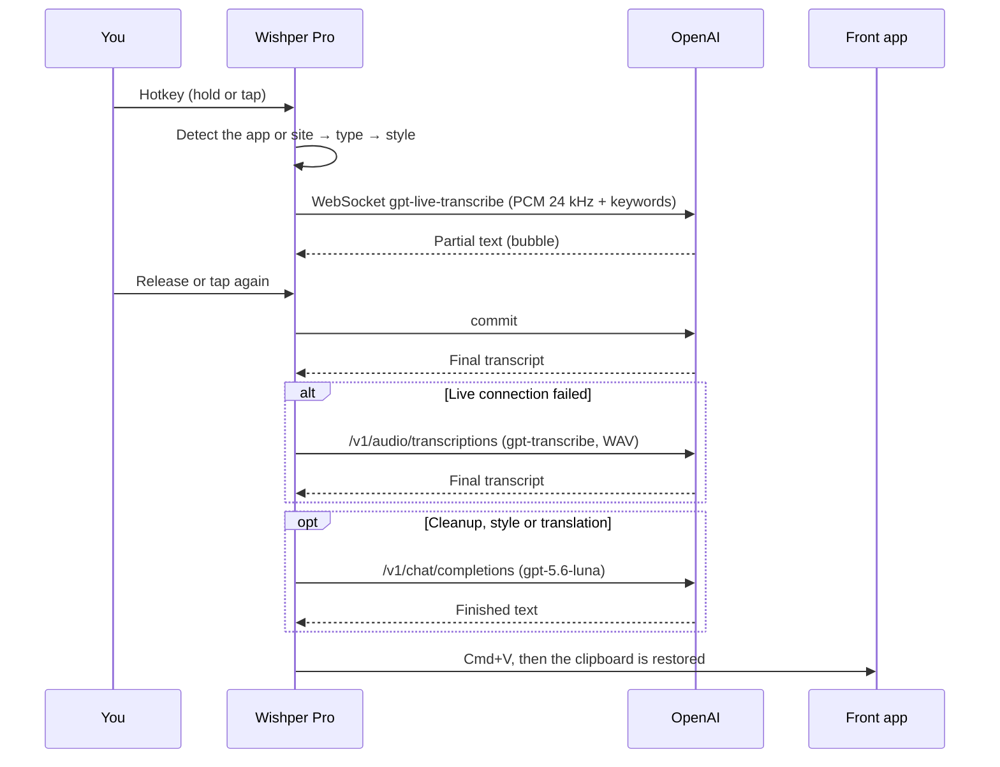

<div align="center">


# Wishper Pro

**Dictation for macOS that pastes finished text — not a raw transcript.**

Hold a hotkey, speak, and the words land in whatever app you are in: cleaned up, in the tone that suits that app, with your own names spelled the way you write them.

[](https://github.com/pixelhunter1/wishper-pro-labs/releases/latest)

[](https://github.com/pixelhunter1/wishper-pro-labs/releases/latest)
[](#requirements)
[](Package.swift)
[](LICENSE)



</div>

> [!NOTE]
> The app's own interface is in European Portuguese. Dictation works in Portuguese (Portugal and Brazil), English, Spanish, French, German and Italian.

## Highlights

- **Live text while you speak.** `gpt-live-transcribe` streams the words into a floating bubble, and the final text is ready about a second after you stop.
- **Cleaned up, not raw.** One `gpt-5.6-luna` call removes hesitations and repetitions and fixes punctuation — while keeping your words, names, numbers and technical terms.
- **A tone that fits the destination.** The app sees which app is in front and, in a browser, which site, then applies the style you picked for that kind of place: casual in chats, formal in email, natural in documents and AI chats.
- **Your own vocabulary.** Names, brands and acronyms go to the speech model as keywords and to the cleanup step as spelling rules, so "Wishper Pro" never comes back as "Whisper Pro".
- **Never loses a dictation.** If the cleanup call fails or times out, the transcript is pasted anyway with a warning. If the live connection drops, the recording is transcribed by `gpt-transcribe` instead.
- **Your clipboard survives.** What you had copied is put back after the paste, and the pasted text is marked as transient so clipboard managers skip it.
- **Push-to-talk or hands-free.** Hold the hotkey to talk, or tap it once to keep recording and again to stop. `Esc` cancels.
- **Screen recording (macOS 15+).** Record a display, a window or an app picked in the system picker, with the microphone you choose and, if you want, the Mac's sound. No Screen Recording permission is needed, the bubble never shows in the video, and your voice goes in its own track on the video's clock — ready for translation.
- **A menu bar app.** No Dock icon by default, native Settings with a Finder-style sidebar, follows light and dark mode, and supports VoiceOver, Reduce Motion, Reduce Transparency and Increase Contrast.
- **No backend.** Dictation audio never touches the disk, the API key lives in the Keychain, and settings live in UserDefaults.

## Screenshots

<p align="center">
  
  &nbsp;&nbsp;
  
</p>

## How it works


```mermaid
sequenceDiagram
    participant U as You
    participant A as Wishper Pro
    participant O as OpenAI
    participant M as Front app

    U->>A: Hotkey (hold or tap)
    A->>A: Detect the app or site → type → style
    A->>O: WebSocket gpt-live-transcribe (PCM 24 kHz + keywords)
    O-->>A: Partial text (bubble)
    U->>A: Release or tap again
    A->>O: commit
    O-->>A: Final transcript
    alt Live connection failed
        A->>O: /v1/audio/transcriptions (gpt-transcribe, WAV)
        O-->>A: Final transcript
    end
    opt Cleanup, style or translation
        A->>O: /v1/chat/completions (gpt-5.6-luna)
        O-->>A: Finished text
    end
    A->>M: Cmd+V, then the clipboard is restored
```

## Requirements

- macOS 13 or later (the bubble uses Liquid Glass on macOS 26; screen recording needs macOS 15)
- An [OpenAI API key](https://platform.openai.com/api-keys)
- To build from source: Xcode Command Line Tools with Swift 6.2

## Install

### Download

1. Grab the latest `.zip` from the [releases page](https://github.com/pixelhunter1/wishper-pro-labs/releases/latest) and move **Wishper Pro.app** to `~/Applications`.
2. The build is signed ad-hoc — there is no Apple Developer certificate behind it — so macOS blocks the first launch. Right-click the app, choose **Open**, then **Open** again in the dialog.

### Build from source

```bash
git clone https://github.com/pixelhunter1/wishper-pro-labs.git
cd wishper-pro-labs
./scripts/install-local-release.sh
```

This builds a release binary and installs `~/Applications/Wishper Pro.app`.

## First run

Settings open by themselves while anything is missing:

1. **Geral** — paste your API key (`sk-…`) and press **Guardar**. It is stored in the Keychain of this Mac.
2. **Permissões** — allow the **microphone** and **accessibility**. Accessibility is what lets the app paste into other apps.
3. Optional: start at login, and show an icon in the Dock.

> [!TIP]
> Because the app is signed ad-hoc, its identity changes on every build, and macOS drops the permissions you granted to the previous one. Either re-grant them (`tccutil reset Accessibility com.wishper.pro`, same for `Microphone`), or sign with your own self-signed code-signing certificate so they stick:
> ```bash
> WISHPER_SIGN_IDENTITY="Your Certificate" ./scripts/install-local-release.sh
> ```

## Using it

1. Put the cursor where the text should go.
2. Hold **Option + Space** and speak; let go when you are done. A quick tap instead keeps recording hands-free until you tap again.
3. The text shows up in the bubble while you speak and is pasted when you stop. `Esc` cancels without pasting.

To record the screen, open the menu bar menu and choose **Gravar ecrã…**, then pick a display, a window or an app. After a 3-2-1 countdown the bubble shows the time; choose **Parar gravação** in the menu, or press **Control-Command-Esc**, to stop. The file lands in `~/Movies/Wishper Pro` and Finder shows it. **Microfone** and **Som do Mac** in the same menu set what the next recording captures.

## Settings

Open them with **⌘,** or from the menu bar. The sidebar lists these pages; the last three sit under **Texto**.

| Page | What it holds |
|---|---|
| **Geral** | API key, permissions, start at login, Dock icon |
| **Ditado** | Hotkey and behaviour (automatic, hold, toggle), dictation language, auto-paste, clipboard restore |
| **Bolha** | Bubble style (live text, compact, hidden), position, and a preview |
| **Estilos** | AI cleanup on/off, a style per app type (AI chats, messages, email, documents, other), and the type of each app or site you have dictated into |
| **Dicionário** | Your names, brands and acronyms |
| **Tradução** | Translate after transcribing, and into which language |

## Models and cost

| Model | Used for | Price |
|---|---|---|
| `gpt-live-transcribe` | live dictation | $0.017 / min |
| `gpt-transcribe` | fallback when the live connection fails | $0.0045 / min |
| `gpt-5.6-luna` | cleanup, style and translation | ≈ $0.0002 per dictation |

Roughly $0.02 for a minute of dictation, billed to your own OpenAI account.

## Privacy

- No backend of its own: the app talks only to the OpenAI API.
- Dictation audio is kept in memory for the duration of the dictation and never written to disk. Screen recordings are saved only to `~/Movies/Wishper Pro` and never uploaded.
- In a browser, only the site's **domain** is stored, on this Mac, to remember its type. The full address never leaves the machine, and the cleanup request carries only the app's name and the type.
- The API key lives in the Keychain (`com.wishperpro.desktop` / `openai-api-key`).
- Turning off **Melhorar o texto com IA** removes the cleanup call entirely; the transcription itself is still done by a speech model.

## Troubleshooting

| What you see | What to do |
|---|---|
| "Permissão de microfone negada." | System Settings → Privacy & Security → Microphone |
| It says "Copiado" instead of pasting | The accessibility permission is missing or no longer matches the build |
| "Não ouvi nada." | The input level stayed low: check the input device and speak at a normal volume |
| "A API key é inválida." | Save the key again in Settings → Geral |
| "Colado sem limpeza: …" | The cleanup call failed or timed out; the transcript was pasted as it came |
| A site shows up as "Outros" | The browser did not expose its address (accessibility is required), or the site is not in the built-in list — pick its type in Settings → Estilos |
| No "Gravar ecrã…" in the menu | Screen recording needs macOS 15 or later |
| "Gravação interrompida: …" | The recorded window closed, the display went away or the disk filled up; what was recorded is in `~/Movies/Wishper Pro` |

## Project layout

```text
Sources/WishperPro/
  SelfTest.swift              # @main + --selftest checks
  WishperProApp.swift         # menu bar app + Settings window
  SettingsView.swift
  VoicePasteViewModel.swift
  RecordingController.swift   # screen recording: picker, countdown, file in Finder
  TextStyles.swift            # app types, styles, catalog, dictionary, settings
  DictationSession.swift
  VoiceBubbleView.swift
  BrandMark.swift
  Services/
    MicrophoneStream.swift
    OpenAIRealtimeTranscriber.swift
    OpenAITranscriptionClient.swift
    OpenAITextProcessor.swift
    RecordingWriter.swift
    ScreenRecorder.swift
    FocusDetector.swift
    GlobalHotkeyMonitor.swift
    AutoPaster.swift
    FloatingBubbleController.swift
    KeychainService.swift
    SoundCuePlayer.swift
    Permissions.swift
```

Design documents live in [`docs/superpowers/specs`](docs/superpowers/specs) and the implementation plans in [`docs/superpowers/plans`](docs/superpowers/plans).

## Development

```bash
swift build                          # debug build
.build/debug/WishperPro --selftest   # 155 offline checks, no network
./scripts/run-dev-app.sh --selftest  # the offline checks plus live, fallback and cleanup against the API
./scripts/run-dev-app.sh             # a dev app bundle in /tmp, for testing the interface
```

There is no test target: the checks live in `SelfTest.swift` and run from the binary. Swift Package Manager only, no external dependencies.

## License

[MIT](LICENSE) © 2026 Miguel Carneiro
