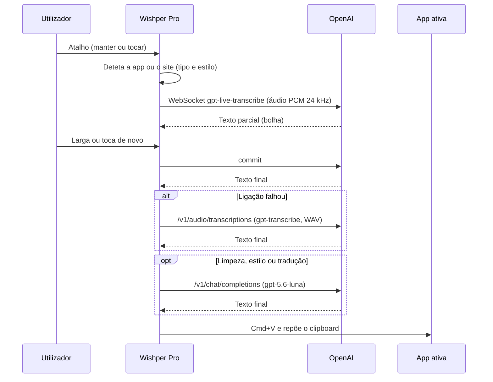

# Wishper Pro (macOS)

Ditado com IA para macOS: carregas no atalho, falas, vês o texto a aparecer e ele é colado na app onde estás.

## Destaques

- **Texto ao vivo** enquanto falas (`gpt-live-transcribe`), pronto quase no instante em que paras.
- **Texto limpo com IA** (`gpt-5.6-luna`): sem hesitações nem repetições e com a pontuação corrigida, mantendo as tuas palavras.
- **Estilo por app ou site:** Casual nas mensagens, Formal no email, Natural nos chats de IA e documentos (tudo ajustável). Deteta o site no Safari e nos browsers Chromium.
- **Dicionário pessoal:** nomes, marcas e siglas escritos como queres, na transcrição e na limpeza.
- **Plano B automático:** se a ligação ao vivo falhar, o áudio (em memória) segue para `gpt-transcribe`.
- **Bolha flutuante** discreta: Texto ao vivo, Compacta ou Oculta; em baixo ao centro, em cima ao centro ou no canto; Liquid Glass no macOS 26.
- **Atalho moderno:** mantém premido para falar ou toca para mãos-livres (também Manter premido ou Alternar). Esc cancela.
- **Clipboard intacto:** o que tinhas copiado volta depois de colar.
- **Tradução** opcional, na mesma chamada da limpeza.
- **App de barra de menus** com Definições nativas (⌘,), claro/escuro do sistema e acessibilidade (VoiceOver, Reduzir movimento, Reduzir transparência, Aumentar contraste).
- API key só no Keychain; sem backend, sem base de dados.

## Como funciona


```mermaid
sequenceDiagram
    participant U as Utilizador
    participant A as Wishper Pro
    participant O as OpenAI
    participant M as App ativa

    U->>A: Atalho (manter ou tocar)
    A->>A: Deteta a app ou o site (tipo e estilo)
    A->>O: WebSocket gpt-live-transcribe (áudio PCM 24 kHz)
    O-->>A: Texto parcial (bolha)
    U->>A: Larga ou toca de novo
    A->>O: commit
    O-->>A: Texto final
    alt Ligação falhou
        A->>O: /v1/audio/transcriptions (gpt-transcribe, WAV)
        O-->>A: Texto final
    end
    opt Limpeza, estilo ou tradução
        A->>O: /v1/chat/completions (gpt-5.6-luna)
        O-->>A: Texto final
    end
    A->>M: Cmd+V e repõe o clipboard
```

## Requisitos

- macOS 13+ (Liquid Glass no macOS 26)
- Xcode Command Line Tools (Swift 6.2)
- API key da OpenAI

## Instalação

```bash
# Release em ~/Applications/Wishper Pro.app
./scripts/install-local-release.sh

# Dev em /tmp/Wishper Pro Dev.app
./scripts/run-dev-app.sh

# Verificações (offline + ao vivo + plano B)
./scripts/run-dev-app.sh --selftest
```

## Primeira configuração

Na primeira vez abrem-se as Definições (ícone na barra de menus > Definições…):

1. **Geral:** colar a API key (`sk-…`) e Guardar.
2. **Permissões:** permitir o Microfone e a Acessibilidade (esta é necessária para colar).
3. Opcional: "Abrir ao iniciar sessão" e "Mostrar ícone na Dock".

## Utilização

1. Coloca o cursor num campo de texto em qualquer app.
2. Mantém premido o atalho (predefinição `Option + Space`) e fala; larga para terminar. Em alternativa, toca uma vez para começar e outra para terminar.
3. O texto aparece na bolha enquanto falas e é colado quando paras.
4. `Esc` durante o ditado cancela sem colar.

## Definições

| Separador | Opções |
|---|---|
| Geral | API key, permissões, abrir ao iniciar sessão, ícone na Dock |
| Ditado | atalho, comportamento (Automático / Manter premido / Alternar), língua, colar automaticamente, repor clipboard |
| Estilos | melhorar o texto com IA, estilo por tipo (Chats de IA, Mensagens, Email, Documentos e notas, Outros), tipo de cada app ou site |
| Dicionário | nomes, marcas e siglas |
| Tradução | ativar, língua de destino |
| Bolha | estilo (Texto ao vivo / Compacta / Oculta), posição, pré-visualização |

## Custos (referência)

- `gpt-live-transcribe`: $0,017/min
- `gpt-transcribe` (só no plano B): $0,0045/min
- `gpt-5.6-luna` (limpeza e tradução): ≈ $0,0002 por ditado

## Privacidade

- Sem backend próprio; o áudio fica só em memória durante o ditado.
- A API key fica no Keychain (`com.wishperpro.desktop` / `openai-api-key`).
- O texto colado é marcado como temporário para os gestores de clipboard não o guardarem.
- Nos sites, só o domínio fica guardado no Mac (lista "Apps e sites"); à OpenAI chegam o nome da app e o tipo, nunca o endereço.

## Resolução de problemas

- **"Permissão de microfone negada":** Definições do Sistema > Privacidade e Segurança > Microfone.
- **Fica "Copiado" em vez de colar:** falta a permissão de Acessibilidade.
- **"Não ouvi nada.":** o nível do microfone ficou sempre baixo; confirma o microfone de entrada.
- **"A API key é inválida.":** guarda de novo a key em Definições > Geral.
- **"Não foi possível ativar o atalho…":** conflito com outro atalho; escolhe outro em Definições > Ditado.
- **"Colado sem limpeza: …":** a IA não respondeu a tempo ou deu erro; o texto transcrito foi colado na mesma.
- **Um site aparece como Outros:** o browser não deu o endereço (é preciso a permissão de Acessibilidade) ou o site não está na lista; escolhe o tipo em Definições > Estilos.

## Estrutura

```text
Sources/WishperPro/
  SelfTest.swift              # @main + --selftest
  WishperProApp.swift         # barra de menus + Definições
  SettingsView.swift
  VoicePasteViewModel.swift
  TextStyles.swift            # tipos, estilos, catálogo, dicionário, TextSettings
  DictationSession.swift
  VoiceBubbleView.swift
  BrandMark.swift
  Services/
    MicrophoneStream.swift
    OpenAIRealtimeTranscriber.swift
    OpenAITranscriptionClient.swift
    OpenAITextProcessor.swift
    FocusDetector.swift
    GlobalHotkeyMonitor.swift
    AutoPaster.swift
    FloatingBubbleController.swift
    KeychainService.swift
    SoundCuePlayer.swift
    Permissions.swift
```
