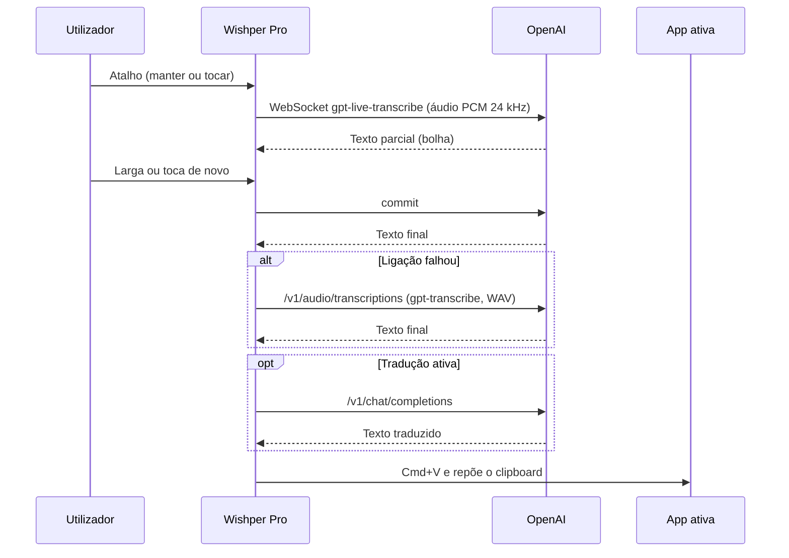

# Ditado ao vivo + bolha nova + interface nativa — plano de implementação

> **For agentic workers:** REQUIRED SUB-SKILL: Use superpowers:subagent-driven-development (recommended) or superpowers:executing-plans to implement this plan task-by-task. Steps use checkbox (`- [ ]`) syntax for tracking.

**Goal:** Texto ao vivo enquanto se dita (`gpt-live-transcribe`), bolha flutuante moderna, atalho manter/tocar, clipboard reposto e app de barra de menus com Definições nativas e a marca Wishper Pro.

**Architecture:** Um `DictationSession` por ditado junta `MicrophoneStream` (AVAudioEngine → PCM16 24 kHz), `OpenAIRealtimeTranscriber` (actor WebSocket) e o plano B `OpenAITranscriptionClient` (`gpt-transcribe`). O `VoicePasteViewModel` (@MainActor) continua a ser a fonte de verdade (`DictationPhase`) para o menu (`MenuBarExtra`), a janela `Settings` e a bolha (`FloatingBubbleController`). As verificações vivem em `SelfTest.swift` (`WishperPro --selftest`).

**Tech Stack:** Swift 6.2, SwiftUI + AppKit, AVFoundation, Carbon, ServiceManagement, URLSessionWebSocketTask. Sem dependências externas.

**Spec:** `docs/superpowers/specs/2026-09-16-ditado-ao-vivo-design.md`

## Global Constraints

- Swift 6.2 em modo Swift 6 (concorrência estrita): `swift build` sem erros nem avisos novos.
- Deployment target macOS 13; APIs do macOS 14/26 só atrás de `#available`. Sem alterações a `Package.swift`.
- Sem dependências externas.
- Texto de interface e mensagens de erro em pt-PT; erros de serviços como enums `LocalizedError`.
- Chaves de UserDefaults com prefixo `wishper.` (tabela "Definições novas" da spec).
- Modelos: `gpt-live-transcribe` (ao vivo), `gpt-transcribe` (plano B), `gpt-4o-mini` (tradução, sem mudanças nesta parte).
- WebSocket `wss://api.openai.com/v1/realtime?intent=transcription`, sem header `OpenAI-Beta`; PCM16 LE 24 kHz mono; `turn_detection: null`; `delay: "low"`.
- Correr todos os comandos a partir da raiz da worktree `.claude/worktrees/ditado-ao-vivo` (branch `worktree-ditado-ao-vivo`). Outra sessão usa a pasta principal: nunca usar `git stash` sem etiqueta nem mudar de branch lá.
- Commits em inglês, a terminar com `Co-Authored-By: Claude Opus 5 <noreply@anthropic.com>`.
- O código de cada tarefa foi compilado num protótipo (Swift 6, macOS 13) e as verificações offline passaram; se algo não compilar, corrigir o mínimo e anotar no commit.

## Estrutura de ficheiros

| Ficheiro | Responsabilidade | Tarefa |
|---|---|---|
| `Sources/WishperPro/SelfTest.swift` | `@main`; `--selftest` (verificações offline e online) | 1 (+2, 4, 6, 7, 8, 9) |
| `Sources/WishperPro/BrandMark.swift` | símbolo da marca como imagem template + `BrandMarkView` | 2 |
| `Sources/WishperPro/WishperProApp.swift` | `MenuBarExtra` + `Settings`, `AppDelegate`, `SettingsOpener`, menu | 3 |
| `Sources/WishperPro/SettingsView.swift` | janela Definições (Geral, Ditado, Bolha, Tradução) | 3 (+5, 8, 10) |
| `Sources/WishperPro/ContentView.swift` | apagado | 3 |
| `Sources/WishperPro/Services/GlobalHotkeyMonitor.swift` | atalho premir/largar, Esc, `HotkeyDecider` | 4, 5 |
| `Sources/WishperPro/Services/MicrophoneStream.swift` | `PCM16`, `WAV`, `PCMConverter`, `MicrophoneStream` | 6 |
| `Sources/WishperPro/Services/OpenAIRealtimeTranscriber.swift` | ligação ao vivo (actor) | 7 |
| `Sources/WishperPro/Services/AutoPaster.swift` | colar, copiar, guardar/repor clipboard | 8 |
| `Sources/WishperPro/Services/OpenAITranscriptionClient.swift` | plano B `gpt-transcribe` | 9 |
| `Sources/WishperPro/DictationSession.swift` | um ditado: microfone + ao vivo + plano B | 9 |
| `Sources/WishperPro/Services/AudioRecorder.swift` | apagado | 9 |
| `Sources/WishperPro/VoicePasteViewModel.swift` | fonte de verdade; reescrito na tarefa 9 | 3, 5, 8, 9, 10 |
| `Sources/WishperPro/Services/FloatingBubbleController.swift` | painel da bolha, estilos e posições | 9, 10 |
| `Sources/WishperPro/VoiceBubbleView.swift` | vista da bolha | 10 |
| `scripts/run-dev-app.sh`, `scripts/install-local-release.sh` | `--selftest`, `BrandMark.svg`, `LSUIElement` | 1, 2, 3 |
| `CLAUDE.md`, `README.md` | documentação | 11 |

---

### Task 1: Ponto de entrada e autoteste (`--selftest`)

**Files:**
- Create: `Sources/WishperPro/SelfTest.swift`
- Modify: `Sources/WishperPro/WishperProApp.swift:3` (remover `@main`)
- Modify: `scripts/run-dev-app.sh` (função `main`)

**Interfaces:**
- Produces: `SelfTest.check(_ condition: Bool, _ label: String)`; funções privadas `runOfflineChecks()` e `runOnlineChecks(audioURL: URL) async` onde as tarefas seguintes registam verificações; `./scripts/run-dev-app.sh --selftest` (gera áudio com `say -v Joana` e corre o autoteste dentro do bundle).

- [ ] **Step 1: Criar `SelfTest.swift`**

```swift
import AppKit
import Foundation

@main
enum AppEntry {
    @MainActor
    static func main() {
        let arguments = CommandLine.arguments
        if let index = arguments.firstIndex(of: "--selftest") {
            let audioPath = arguments.indices.contains(index + 1) ? arguments[index + 1] : nil
            SelfTest.run(audioPath: audioPath)
        }
        WishperProApp.main()
    }
}

/// `WishperPro --selftest [audio]`: offline checks, plus live and fallback transcription when an audio file is given.
@MainActor
enum SelfTest {
    private static var failures = 0

    static func run(audioPath: String?) -> Never {
        print("== Verificações offline ==")
        runOfflineChecks()
        guard let audioPath else { finish() }
        Task {
            print("== Verificações online (\(audioPath)) ==")
            await runOnlineChecks(audioURL: URL(fileURLWithPath: audioPath))
            finish()
        }
        dispatchMain()
    }

    static func check(_ condition: Bool, _ label: String) {
        if !condition { failures += 1 }
        print(condition ? "  ok      \(label)" : "  FALHOU  \(label)")
    }

    private static func finish() -> Never {
        print(failures == 0 ? "== Tudo OK ==" : "== \(failures) verificação(ões) falhada(s) ==")
        exit(failures == 0 ? 0 : 1)
    }

    private static func runOfflineChecks() {
        check(CommandLine.arguments.contains("--selftest"), "autoteste arrancou sem abrir a app")
    }

    private static func runOnlineChecks(audioURL: URL) async {
        check(FileManager.default.fileExists(atPath: audioURL.path), "ficheiro de áudio existe")
    }
}
```

- [ ] **Step 2: Tirar `@main` de `WishperProApp`**

Em `Sources/WishperPro/WishperProApp.swift`, apagar a linha `@main` (linha 3). A struct `WishperProApp` fica igual.

- [ ] **Step 3: Compilar e correr o autoteste**

Run: `swift build && .build/debug/WishperPro --selftest; echo "exit=$?"`
Expected: `ok      autoteste arrancou sem abrir a app`, `== Tudo OK ==`, `exit=0`, e nenhuma janela abre.

- [ ] **Step 4: Opção `--selftest` no script dev**

Em `scripts/run-dev-app.sh`, substituir a função `main()` inteira por:

```zsh
main() {
  cd "$ROOT_DIR"
  local selftest=false
  if [[ "${1:-}" == "--selftest" ]]; then
    selftest=true
  fi

  echo "[1/5] Building debug binary..."
  swift build

  local signing_identity
  signing_identity="$(detect_signing_identity)"
  echo "[2/5] Using signing identity: $signing_identity"

  echo "[3/5] Creating dev app bundle at $APP_PATH"
  rm -rf "$APP_PATH"
  mkdir -p "$APP_PATH/Contents/MacOS" "$APP_PATH/Contents/Resources"
  cp ".build/debug/$EXECUTABLE_NAME" "$APP_PATH/Contents/MacOS/$EXECUTABLE_NAME"
  chmod +x "$APP_PATH/Contents/MacOS/$EXECUTABLE_NAME"
  if [[ -f "$ICON_PATH" ]]; then
    cp "$ICON_PATH" "$APP_PATH/Contents/Resources/AppIcon.icns"
  fi
  write_info_plist

  echo "[4/5] Signing dev bundle..."
  codesign --force --deep --sign "$signing_identity" \
    --entitlements "$ENTITLEMENTS_PATH" \
    "$APP_PATH"
  xattr -dr com.apple.quarantine "$APP_PATH" || true

  if [[ "$selftest" == true ]]; then
    local audio_path="${TMPDIR:-/tmp}/wishper-selftest.aiff"
    echo "[5/5] Running self-test..."
    say -v Joana -o "$audio_path" "Olá, isto é um teste do Wishper Pro. O ditado ao vivo está a funcionar."
    "$APP_PATH/Contents/MacOS/$EXECUTABLE_NAME" --selftest "$audio_path"
    return
  fi

  echo "[5/5] Opening dev app..."
  pkill -f 'WishperPro' || true
  open "$APP_PATH"

  echo "Done."
}
```

- [ ] **Step 5: Correr o autoteste pelo script**

Run: `./scripts/run-dev-app.sh --selftest; echo "exit=$?"`
Expected: `ok      ficheiro de áudio existe`, `== Tudo OK ==`, `exit=0`; a app não abre.

- [ ] **Step 6: Confirmar que a app continua a abrir**

Run: `./scripts/run-dev-app.sh`
Expected: a app abre como antes (janela Início/Opções).

- [ ] **Step 7: Commit**

```bash
git add Sources/WishperPro/SelfTest.swift Sources/WishperPro/WishperProApp.swift scripts/run-dev-app.sh
git commit -m "Add --selftest entry point and dev script option

Co-Authored-By: Claude Opus 5 <noreply@anthropic.com>"
```

---

### Task 2: Símbolo da marca (`BrandMark`)

**Files:**
- Create: `Sources/WishperPro/BrandMark.swift`
- Modify: `Sources/WishperPro/SelfTest.swift` (nova verificação)
- Modify: `scripts/run-dev-app.sh`, `scripts/install-local-release.sh` (copiar `logo.svg`)

**Interfaces:**
- Produces: `BrandMark.image(pointSize: CGFloat) -> NSImage` (@MainActor, template, com cache); `BrandMarkView(size: CGFloat = 16)`; recurso `Contents/Resources/BrandMark.svg`.

- [ ] **Step 1: Escrever a verificação (falha a compilar)**

Em `SelfTest.swift`, acrescentar dentro de `enum SelfTest`:

```swift
    private static func checkBrandMark() {
        let mark = BrandMark.image(pointSize: 18)
        check(mark.isTemplate, "marca: imagem template (adapta-se a claro/escuro)")
        if Bundle.main.url(forResource: "BrandMark", withExtension: "svg") != nil {
            check(mark.size == NSSize(width: 18, height: 18), "marca: 18 pt a partir do BrandMark.svg")
            check(mark.representations.count == 2, "marca: versões @1x e @2x")
        } else {
            print("  info    BrandMark.svg não está no bundle; a usar o símbolo waveform")
        }
    }
```

e, em `runOfflineChecks()`, acrescentar a linha `checkBrandMark()`.

- [ ] **Step 2: Confirmar que falha**

Run: `swift build`
Expected: FAIL com `cannot find 'BrandMark' in scope`.

- [ ] **Step 3: Criar `BrandMark.swift`**

```swift
import AppKit
import SwiftUI

/// Wishper Pro's monochrome mark (`BrandMark.svg`, copied from logo.svg) as a template image:
/// luminance becomes alpha, so the black background disappears and the system tints the swirl.
enum BrandMark {
    /// Calibration knob: values below 1 lift the mid-greys so the swirl stays readable at 16–18 pt.
    static let gamma: CGFloat = 0.7

    @MainActor private static var cache: [CGFloat: NSImage] = [:]

    @MainActor
    static func image(pointSize: CGFloat) -> NSImage {
        if let cached = cache[pointSize] { return cached }
        let image = makeImage(pointSize: pointSize) ?? fallbackImage(pointSize: pointSize)
        cache[pointSize] = image
        return image
    }

    private static func makeImage(pointSize: CGFloat) -> NSImage? {
        guard let url = Bundle.main.url(forResource: "BrandMark", withExtension: "svg"),
              let svg = NSImage(contentsOf: url) else { return nil }
        let image = NSImage(size: NSSize(width: pointSize, height: pointSize))
        for scale in [1, 2] as [CGFloat] {
            guard let cgImage = templateCGImage(svg: svg, pixels: Int(pointSize * scale)) else { return nil }
            let rep = NSBitmapImageRep(cgImage: cgImage)
            rep.size = image.size
            image.addRepresentation(rep)
        }
        image.isTemplate = true
        return image
    }

    private static func templateCGImage(svg: NSImage, pixels: Int) -> CGImage? {
        let bounds = CGRect(x: 0, y: 0, width: pixels, height: pixels)
        var proposed = bounds
        guard let raster = svg.cgImage(forProposedRect: &proposed, context: nil, hints: nil),
              let gray = CGContext(
                  data: nil, width: pixels, height: pixels, bitsPerComponent: 8, bytesPerRow: pixels,
                  space: CGColorSpaceCreateDeviceGray(), bitmapInfo: CGImageAlphaInfo.none.rawValue
              )
        else { return nil }
        gray.interpolationQuality = .high
        gray.draw(raster, in: bounds)
        if let luminance = gray.data?.assumingMemoryBound(to: UInt8.self) {
            for index in 0..<(pixels * pixels) {
                luminance[index] = UInt8((pow(CGFloat(luminance[index]) / 255, gamma) * 255).rounded())
            }
        }
        guard let mask = gray.makeImage(),
              let output = CGContext(
                  data: nil, width: pixels, height: pixels, bitsPerComponent: 8, bytesPerRow: pixels * 4,
                  space: CGColorSpaceCreateDeviceRGB(), bitmapInfo: CGImageAlphaInfo.premultipliedLast.rawValue
              )
        else { return nil }
        output.clip(to: bounds, mask: mask)
        output.setFillColor(CGColor(gray: 0, alpha: 1))
        output.fill(bounds)
        return output.makeImage()
    }

    /// Used when the SVG isn't in the bundle (e.g. `swift build` binary) or can't be loaded.
    private static func fallbackImage(pointSize: CGFloat) -> NSImage {
        let configuration = NSImage.SymbolConfiguration(pointSize: pointSize * 0.8, weight: .medium)
        let image = NSImage(systemSymbolName: "waveform", accessibilityDescription: "Wishper Pro")?
            .withSymbolConfiguration(configuration) ?? NSImage(size: NSSize(width: pointSize, height: pointSize))
        image.isTemplate = true
        return image
    }
}

struct BrandMarkView: View {
    var size: CGFloat = 16

    var body: some View {
        Image(nsImage: BrandMark.image(pointSize: size))
            .renderingMode(.template)
            .resizable()
            .scaledToFit()
            .frame(width: size, height: size)
            .accessibilityHidden(true)
    }
}
```

- [ ] **Step 4: Verificar sem bundle**

Run: `swift build && .build/debug/WishperPro --selftest`
Expected: `ok      marca: imagem template…`, a linha `info    BrandMark.svg não está no bundle…` e `== Tudo OK ==`.

- [ ] **Step 5: Copiar o SVG nos dois scripts**

Em `scripts/run-dev-app.sh` e em `scripts/install-local-release.sh`, logo a seguir ao bloco `if [[ -f "$ICON_PATH" ]]; then … fi`, acrescentar:

```zsh
  cp "$ROOT_DIR/logo.svg" "$APP_PATH/Contents/Resources/BrandMark.svg"
```

- [ ] **Step 6: Verificar dentro do bundle**

Run: `./scripts/run-dev-app.sh --selftest`
Expected: `ok      marca: 18 pt a partir do BrandMark.svg`, `ok      marca: versões @1x e @2x`, `== Tudo OK ==`.

- [ ] **Step 7: Commit**

```bash
git add Sources/WishperPro/BrandMark.swift Sources/WishperPro/SelfTest.swift scripts/run-dev-app.sh scripts/install-local-release.sh
git commit -m "Add monochrome brand mark rendered from logo.svg

Co-Authored-By: Claude Opus 5 <noreply@anthropic.com>"
```

---

### Task 3: App de barra de menus + Definições nativas

**Files:**
- Create: `Sources/WishperPro/SettingsView.swift`
- Modify: `Sources/WishperPro/WishperProApp.swift` (substituir o conteúdo)
- Modify: `Sources/WishperPro/VoicePasteViewModel.swift` (edições A–K)
- Delete: `Sources/WishperPro/ContentView.swift`
- Modify: `scripts/run-dev-app.sh`, `scripts/install-local-release.sh` (`LSUIElement`)

**Interfaces:**
- Consumes: `BrandMark.image(pointSize:)`, `BrandMarkView` (tarefa 2).
- Produces: `SettingsOpener.open()` (@MainActor); `SystemSettings.open(_ pane: SystemSettings.Pane)` com `.microphone`/`.accessibility`; `Bundle.appVersion`; `MenuBarContent`, `MenuBarLabel`; no ViewModel: `showInDock`, `microphoneStatus`, `launchAtLoginEnabled`, `needsSetup`, `menuStatusText`, `refreshPermissions()`, `requestMicrophoneAccess()`, `setLaunchAtLogin(_:)`, `applyDockVisibility()`, `copyLastTranscript()`; `private enum DefaultsKey` e funções `storedBool(_:default:)`, `storedLanguage(_:default:)` ao nível do ficheiro.

- [ ] **Step 1: Criar `SettingsView.swift`**

```swift
import AppKit
import AVFoundation
import SwiftUI

/// Deep links to the Privacy panes of System Settings.
enum SystemSettings {
    enum Pane: String {
        case microphone = "Privacy_Microphone"
        case accessibility = "Privacy_Accessibility"
    }

    static func open(_ pane: Pane) {
        guard let url = URL(string: "x-apple.systempreferences:com.apple.preference.security?\(pane.rawValue)") else {
            return
        }
        NSWorkspace.shared.open(url)
    }
}

extension Bundle {
    var appVersion: String {
        infoDictionary?["CFBundleShortVersionString"] as? String ?? "dev"
    }
}

struct SettingsView: View {
    @ObservedObject var viewModel: VoicePasteViewModel

    var body: some View {
        TabView {
            GeneralSettingsTab(viewModel: viewModel)
                .tabItem { Label("Geral", systemImage: "gearshape") }
            DictationSettingsTab(viewModel: viewModel)
                .tabItem { Label("Ditado", systemImage: "mic") }
            TranslationSettingsTab(viewModel: viewModel)
                .tabItem { Label("Tradução", systemImage: "globe") }
        }
        .frame(width: 540, height: 500)
        .onAppear { viewModel.refreshPermissions() }
        .onReceive(NotificationCenter.default.publisher(for: NSApplication.didBecomeActiveNotification)) { _ in
            viewModel.refreshPermissions()
        }
    }
}

private struct GeneralSettingsTab: View {
    @ObservedObject var viewModel: VoicePasteViewModel

    var body: some View {
        Form {
            Section {
                HStack(spacing: 12) {
                    BrandMarkView(size: 44)
                    VStack(alignment: .leading, spacing: 2) {
                        Text("Wishper Pro")
                            .font(.title2.weight(.semibold))
                        Text("Versão \(Bundle.main.appVersion)")
                            .font(.callout)
                            .foregroundStyle(.secondary)
                    }
                }
                .padding(.vertical, 4)
            }

            Section {
                SecureField("API key", text: $viewModel.apiKeyDraft, prompt: Text("sk-…"))
                    .onSubmit { viewModel.saveAPIKey() }
                HStack {
                    Text(viewModel.keyStatusText)
                        .foregroundStyle(.secondary)
                    Spacer()
                    Button("Remover", role: .destructive) { viewModel.clearAPIKey() }
                        .disabled(!viewModel.isAPIKeySaved)
                    Button("Guardar") { viewModel.saveAPIKey() }
                        .keyboardShortcut(.defaultAction)
                }
            } header: {
                Text("Conta OpenAI")
            } footer: {
                Text("A key fica guardada no Keychain deste Mac.")
            }

            Section("Permissões") {
                PermissionRow(
                    title: "Microfone",
                    detail: "Para ouvir o que dizes.",
                    isGranted: viewModel.microphoneStatus == .authorized,
                    actionTitle: viewModel.microphoneStatus == .notDetermined
                        ? "Permitir…"
                        : "Abrir Definições do Sistema…"
                ) {
                    if viewModel.microphoneStatus == .notDetermined {
                        viewModel.requestMicrophoneAccess()
                    } else {
                        SystemSettings.open(.microphone)
                    }
                }
                PermissionRow(
                    title: "Acessibilidade",
                    detail: "Para colar o texto na app onde estás.",
                    isGranted: viewModel.hasAccessibilityPermission,
                    actionTitle: "Abrir Definições do Sistema…"
                ) {
                    viewModel.requestAccessibilityPermission()
                }
            }

            Section("Arranque") {
                Toggle("Abrir ao iniciar sessão", isOn: Binding(
                    get: { viewModel.launchAtLoginEnabled },
                    set: { viewModel.setLaunchAtLogin($0) }
                ))
                Toggle("Mostrar ícone na Dock", isOn: $viewModel.showInDock)
            }

            if viewModel.isStatusError {
                Section {
                    Label(viewModel.statusMessage, systemImage: "exclamationmark.triangle.fill")
                        .foregroundStyle(.red)
                }
            }
        }
        .formStyle(.grouped)
    }
}

private struct PermissionRow: View {
    let title: String
    let detail: String
    let isGranted: Bool
    let actionTitle: String
    let action: () -> Void

    var body: some View {
        LabeledContent {
            if isGranted {
                Label("Concedida", systemImage: "checkmark.circle.fill")
                    .foregroundStyle(.green)
            } else {
                Button(actionTitle, action: action)
            }
        } label: {
            Text(title)
            Text(detail)
        }
    }
}

private struct DictationSettingsTab: View {
    @ObservedObject var viewModel: VoicePasteViewModel

    var body: some View {
        Form {
            Section("Atalho") {
                LabeledContent("Combinação") {
                    HStack(spacing: 8) {
                        Text(viewModel.isCapturingHotkey ? "Prime a nova combinação…" : viewModel.hotkeyLabel)
                            .foregroundStyle(viewModel.isCapturingHotkey ? .secondary : .primary)
                        if viewModel.isCapturingHotkey {
                            Button("Cancelar") { viewModel.cancelHotkeyCapture() }
                        } else {
                            Button("Alterar…") { viewModel.beginHotkeyCapture() }
                        }
                    }
                }
            }

            Section {
                Picker("Língua do ditado", selection: $viewModel.selectedSourceLanguage) {
                    ForEach(SupportedLanguage.allCases) { language in
                        Text(language.displayName).tag(language)
                    }
                }
            } header: {
                Text("Língua")
            } footer: {
                Text("Escolher a língua certa melhora a precisão. Em Auto, a língua é detetada.")
            }

            Section("Texto") {
                Toggle("Colar automaticamente", isOn: $viewModel.autoPasteEnabled)
            }
        }
        .formStyle(.grouped)
    }
}

private struct TranslationSettingsTab: View {
    @ObservedObject var viewModel: VoicePasteViewModel

    var body: some View {
        Form {
            Section {
                Toggle("Traduzir depois de transcrever", isOn: $viewModel.translationEnabled)
                Picker("Traduzir para", selection: $viewModel.selectedTargetLanguage) {
                    ForEach(SupportedLanguage.targetLanguages) { language in
                        Text(language.displayName).tag(language)
                    }
                }
                .disabled(!viewModel.translationEnabled)
            } footer: {
                Text("A língua de origem é a língua do ditado (separador Ditado).")
            }
        }
        .formStyle(.grouped)
    }
}
```

- [ ] **Step 2: Substituir `WishperProApp.swift`**

```swift
import AppKit
import SwiftUI

struct WishperProApp: App {
    @NSApplicationDelegateAdaptor(AppDelegate.self) private var appDelegate

    var body: some Scene {
        MenuBarExtra {
            MenuBarContent(viewModel: appDelegate.viewModel)
        } label: {
            MenuBarLabel(viewModel: appDelegate.viewModel)
        }
        .menuBarExtraStyle(.menu)

        Settings {
            SettingsView(viewModel: appDelegate.viewModel)
        }
    }
}

@MainActor
final class AppDelegate: NSObject, NSApplicationDelegate {
    let viewModel = VoicePasteViewModel()
    private lazy var bubbleController = FloatingBubbleController(viewModel: viewModel)

    func applicationDidFinishLaunching(_ notification: Notification) {
        viewModel.applyDockVisibility()
        bubbleController.start()
        if viewModel.needsSetup {
            DispatchQueue.main.async { SettingsOpener.open() }
        }
    }

    func applicationShouldHandleReopen(_ sender: NSApplication, hasVisibleWindows flag: Bool) -> Bool {
        SettingsOpener.open()
        return false
    }
}

/// Opens the SwiftUI Settings window from anywhere (menu, first launch, Dock) and brings it to the front.
/// Triggers the app menu's ⌘, item, which SwiftUI creates even for LSUIElement apps (verified on macOS 26).
@MainActor
enum SettingsOpener {
    static func open() {
        NSApp.activate(ignoringOtherApps: true)
        if let appMenu = NSApp.mainMenu?.items.first?.submenu,
           let index = appMenu.items.firstIndex(where: { $0.keyEquivalent == "," }) {
            appMenu.performActionForItem(at: index)
        } else {
            NSApp.sendAction(Selector(("showSettingsWindow:")), to: nil, from: nil)
        }
    }
}

struct MenuBarContent: View {
    @ObservedObject var viewModel: VoicePasteViewModel

    var body: some View {
        Text(viewModel.menuStatusText)
        Button(viewModel.isRecording ? "Parar ditado" : "Iniciar ditado") {
            viewModel.toggleRecordingFromButton()
        }
        .disabled(viewModel.isTranscribing)
        Button("Copiar última transcrição") {
            viewModel.copyLastTranscript()
        }
        .disabled(viewModel.lastTranscript.isEmpty)
        Divider()
        Button("Definições…") {
            SettingsOpener.open()
        }
        .keyboardShortcut(",", modifiers: .command)
        Button("Sobre o Wishper Pro") {
            NSApp.activate(ignoringOtherApps: true)
            NSApp.orderFrontStandardAboutPanel(nil)
        }
        Divider()
        Button("Sair do Wishper Pro") {
            NSApp.terminate(nil)
        }
        .keyboardShortcut("q", modifiers: .command)
    }
}

struct MenuBarLabel: View {
    @ObservedObject var viewModel: VoicePasteViewModel

    var body: some View {
        Group {
            if viewModel.isRecording || viewModel.isTranscribing {
                activeIcon
            } else {
                Image(nsImage: BrandMark.image(pointSize: 18))
                    .renderingMode(.template)
            }
        }
        .accessibilityLabel("Wishper Pro")
    }

    @ViewBuilder
    private var activeIcon: some View {
        if #available(macOS 14.0, *) {
            Image(systemName: "waveform")
                .symbolEffect(.variableColor.iterative, isActive: viewModel.isRecording)
        } else {
            Image(systemName: "waveform")
        }
    }
}
```

- [ ] **Step 3: Editar `VoicePasteViewModel.swift`**

A. Nos imports, depois de `import Foundation`, acrescentar `import ServiceManagement`.

B. Imediatamente antes de `@MainActor` / `final class VoicePasteViewModel`, acrescentar:

```swift
private enum DefaultsKey {
    static let translationEnabled = "wishper.translation_enabled"
    static let translationSource = "wishper.translation_source_language"
    static let translationTarget = "wishper.translation_target_language"
    static let autoPaste = "wishper.auto_paste"
    static let showInDock = "wishper.show_in_dock"
}

private func storedBool(_ key: String, default value: Bool) -> Bool {
    UserDefaults.standard.object(forKey: key) as? Bool ?? value
}

private func storedLanguage(_ key: String, default value: SupportedLanguage) -> SupportedLanguage {
    guard let raw = UserDefaults.standard.string(forKey: key) else { return value }
    // Before pt-PT/pt-BR existed, Portuguese was saved as "pt".
    return SupportedLanguage(rawValue: raw == "pt" ? SupportedLanguage.portuguesePT.rawValue : raw) ?? value
}
```

C. Substituir `    @Published var autoPasteEnabled = true` por:

```swift
    @Published var autoPasteEnabled = storedBool(DefaultsKey.autoPaste, default: true) {
        didSet { UserDefaults.standard.set(autoPasteEnabled, forKey: DefaultsKey.autoPaste) }
    }
    @Published var showInDock = storedBool(DefaultsKey.showInDock, default: false) {
        didSet {
            UserDefaults.standard.set(showInDock, forKey: DefaultsKey.showInDock)
            applyDockVisibility()
            NSApp.activate(ignoringOtherApps: true)
        }
    }
```

D. Substituir `    @Published private(set) var hasAccessibilityPermission = false` por:

```swift
    @Published private(set) var hasAccessibilityPermission = false
    @Published private(set) var microphoneStatus = AVCaptureDevice.authorizationStatus(for: .audio)
    @Published private(set) var launchAtLoginEnabled = SMAppService.mainApp.status == .enabled
```

E. Substituir as três linhas `@Published var translationEnabled = false`, `@Published var selectedSourceLanguage: SupportedLanguage = .auto` e `@Published var selectedTargetLanguage: SupportedLanguage = .english` por:

```swift
    @Published var translationEnabled = storedBool(DefaultsKey.translationEnabled, default: false) {
        didSet { persistTranslationSettings() }
    }
    @Published var selectedSourceLanguage = storedLanguage(DefaultsKey.translationSource, default: .auto) {
        didSet { persistTranslationSettings() }
    }
    @Published var selectedTargetLanguage = storedLanguage(DefaultsKey.translationTarget, default: .english) {
        didSet { persistTranslationSettings() }
    }
```

F. Substituir as propriedades `keyStatusText` e `accessibilityStatusText` por:

```swift
    var keyStatusText: String {
        isAPIKeySaved ? "Guardada no Keychain" : "Sem API key"
    }

    var needsSetup: Bool {
        !isAPIKeySaved || microphoneStatus != .authorized || !hasAccessibilityPermission
    }

    var menuStatusText: String {
        if isRecording { return "A ouvir…" }
        if isTranscribing { return "A finalizar…" }
        if isStatusError { return statusMessage }
        return isHotkeyReady ? "Pronto · \(hotkeyLabel)" : "Atalho indisponível"
    }
```

G. Apagar as propriedades `hotkeyCaptureHint` e `translationStatusText`, e as três constantes `translationEnabledDefaultsKey`, `translationSourceDefaultsKey` e `translationTargetDefaultsKey` (manter `hotkeyDefaultsKey`).

H. No `init()`, apagar a linha `loadPersistedSettings()`.

I. Apagar os métodos `onTranslationSettingsChanged()`, `pasteAPIKeyFromClipboard()`, `loadPersistedSettings()` e `migratePortugueseLanguageSetting(key:)`, e substituir `persistTranslationSettings()` por:

```swift
    private func persistTranslationSettings() {
        let defaults = UserDefaults.standard
        defaults.set(translationEnabled, forKey: DefaultsKey.translationEnabled)
        defaults.set(selectedSourceLanguage.rawValue, forKey: DefaultsKey.translationSource)
        defaults.set(selectedTargetLanguage.rawValue, forKey: DefaultsKey.translationTarget)
    }
```

J. Substituir `requestAccessibilityPermission()` por esta versão e acrescentar os métodos seguintes logo a seguir:

```swift
    func requestAccessibilityPermission() {
        hasAccessibilityPermission = autoPaster.requestAccessibilityPermission()
        if !hasAccessibilityPermission {
            SystemSettings.open(.accessibility)
        }
    }

    func refreshPermissions() {
        hasAccessibilityPermission = autoPaster.hasAccessibilityPermission
        microphoneStatus = AVCaptureDevice.authorizationStatus(for: .audio)
        launchAtLoginEnabled = SMAppService.mainApp.status == .enabled
    }

    func requestMicrophoneAccess() {
        Task {
            _ = await Permissions.requestMicrophoneAccess()
            refreshPermissions()
        }
    }

    func setLaunchAtLogin(_ enabled: Bool) {
        do {
            if enabled {
                try SMAppService.mainApp.register()
            } else {
                try SMAppService.mainApp.unregister()
            }
        } catch {
            setStatus("Não foi possível alterar o arranque automático: \(error.localizedDescription)", isError: true)
        }
        refreshPermissions()
    }

    func applyDockVisibility() {
        NSApp.setActivationPolicy(showInDock ? .regular : .accessory)
    }

    func copyLastTranscript() {
        guard !lastTranscript.isEmpty else { return }
        NSPasteboard.general.clearContents()
        NSPasteboard.general.setString(lastTranscript, forType: .string)
    }
```

K. Em `startRecording(origin:)`, no `guard` da API key, acrescentar `SettingsOpener.open()` antes do `return`:

```swift
        guard let savedKey = activeAPIKey, !savedKey.isEmpty else {
            isAPIKeySaved = false
            setStatus("Guarda a API key antes de iniciar o ditado.", isError: true)
            SettingsOpener.open()
            return
        }
```

- [ ] **Step 4: Apagar a janela antiga**

Run: `git rm Sources/WishperPro/ContentView.swift`

- [ ] **Step 5: `LSUIElement` nos dois scripts**

Em `write_info_plist()` de `scripts/run-dev-app.sh` e de `scripts/install-local-release.sh`, a seguir ao par `LSMinimumSystemVersion`/`13.0`, acrescentar:

```xml
  <key>LSUIElement</key>
  <true/>
```

- [ ] **Step 6: Compilar e correr as verificações**

Run: `swift build && ./scripts/run-dev-app.sh --selftest`
Expected: build sem erros nem avisos novos; `== Tudo OK ==`.

- [ ] **Step 7: Verificação manual**

Run: `./scripts/run-dev-app.sh`
Expected:
- sem ícone na Dock; símbolo da marca na barra de menus (claro e escuro);
- menu: estado, "Iniciar ditado", "Copiar última transcrição" (desativado sem texto), "Definições… ⌘,", "Sobre o Wishper Pro", "Sair do Wishper Pro ⌘Q";
- "Definições…" abre a janela à frente, com os separadores Geral, Ditado e Tradução e o aspeto do sistema (claro/escuro);
- guardar e remover a key; as linhas de permissões mostram o estado real;
- "Mostrar ícone na Dock" mostra e esconde o ícone; "Abrir ao iniciar sessão" aparece em Definições do Sistema > Geral > Itens de início de sessão;
- ditar pelo menu e pelo atalho continua a funcionar (fluxo antigo).

- [ ] **Step 8: Commit**

```bash
git add -A Sources/WishperPro scripts
git commit -m "Turn the app into a menu bar app with a native Settings window

Co-Authored-By: Claude Opus 5 <noreply@anthropic.com>"
```

---

### Task 4: Regras do atalho (`HotkeyDecider`)

**Files:**
- Modify: `Sources/WishperPro/Services/GlobalHotkeyMonitor.swift` (tipos novos no topo, depois dos imports)
- Modify: `Sources/WishperPro/SelfTest.swift`

**Interfaces:**
- Produces: `enum HotkeyBehavior: String, CaseIterable, Identifiable { case auto, hold, toggle }` com `displayName` e `explanation`; `enum HotkeyEvent { case press, release }`; `enum HotkeyState { case idle, listening(handsFree: Bool), busy }`; `enum HotkeyAction { case start, stop, enterHandsFree, ignore }`; `HotkeyDecider.tapThreshold` (0,4 s) e `HotkeyDecider.action(behavior:event:state:heldFor:) -> HotkeyAction`.

- [ ] **Step 1: Escrever as verificações (falham a compilar)**

Em `SelfTest.swift`, acrescentar dentro de `enum SelfTest` e chamar `checkHotkeyDecisions()` em `runOfflineChecks()`:

```swift
    private static func checkHotkeyDecisions() {
        func action(
            _ behavior: HotkeyBehavior,
            _ event: HotkeyEvent,
            _ state: HotkeyState,
            held: TimeInterval = 0
        ) -> HotkeyAction {
            HotkeyDecider.action(behavior: behavior, event: event, state: state, heldFor: held)
        }
        let tap = HotkeyDecider.tapThreshold
        check(action(.toggle, .press, .idle) == .start, "atalho alternar: premir em repouso inicia")
        check(action(.toggle, .press, .listening(handsFree: false)) == .stop, "atalho alternar: premir a ouvir termina")
        check(action(.toggle, .release, .listening(handsFree: false)) == .ignore, "atalho alternar: largar é ignorado")
        check(action(.hold, .press, .idle) == .start, "atalho manter: premir inicia")
        check(action(.hold, .release, .listening(handsFree: false), held: 0.1) == .stop, "atalho manter: largar termina")
        check(action(.auto, .press, .idle) == .start, "atalho automático: premir inicia")
        check(
            action(.auto, .release, .listening(handsFree: false), held: tap - 0.1) == .enterHandsFree,
            "atalho automático: toque passa a mãos-livres"
        )
        check(
            action(.auto, .release, .listening(handsFree: false), held: tap + 0.1) == .stop,
            "atalho automático: largar depois de segurar termina"
        )
        check(action(.auto, .press, .listening(handsFree: true)) == .stop, "atalho automático: premir em mãos-livres termina")
        check(action(.auto, .release, .listening(handsFree: true)) == .ignore, "atalho automático: largar em mãos-livres é ignorado")
        check(action(.auto, .press, .busy) == .ignore, "atalho: a finalizar ignora")
    }
```

- [ ] **Step 2: Confirmar que falha**

Run: `swift build`
Expected: FAIL com `cannot find 'HotkeyDecider' in scope`.

- [ ] **Step 3: Acrescentar os tipos em `GlobalHotkeyMonitor.swift`**

Depois de `import Foundation`, acrescentar:

```swift
enum HotkeyBehavior: String, CaseIterable, Identifiable {
    case auto
    case hold
    case toggle

    var id: String { rawValue }

    var displayName: String {
        switch self {
        case .auto: return "Automático"
        case .hold: return "Manter premido"
        case .toggle: return "Alternar"
        }
    }

    var explanation: String {
        switch self {
        case .auto:
            return "Mantém premido para falar enquanto seguras. Um toque rápido deixa a gravar até voltares a tocar."
        case .hold:
            return "Grava apenas enquanto o atalho estiver premido."
        case .toggle:
            return "Um toque inicia a gravação e outro toque termina."
        }
    }
}

enum HotkeyEvent: Equatable {
    case press
    case release
}

enum HotkeyState: Equatable {
    case idle
    case listening(handsFree: Bool)
    case busy
}

enum HotkeyAction: Equatable {
    case start
    case stop
    case enterHandsFree
    case ignore
}

enum HotkeyDecider {
    /// A press shorter than this is a tap (hands-free in `.auto`).
    static let tapThreshold: TimeInterval = 0.4

    static func action(
        behavior: HotkeyBehavior,
        event: HotkeyEvent,
        state: HotkeyState,
        heldFor: TimeInterval
    ) -> HotkeyAction {
        switch (behavior, event, state) {
        case (_, .press, .idle):
            return .start
        case (.toggle, .press, .listening):
            return .stop
        case (.auto, .press, .listening(handsFree: true)):
            return .stop
        case (.hold, .release, .listening):
            return .stop
        case (.auto, .release, .listening(handsFree: false)):
            return heldFor < tapThreshold ? .enterHandsFree : .stop
        default:
            return .ignore
        }
    }
}
```

- [ ] **Step 4: Confirmar que passa**

Run: `swift build && .build/debug/WishperPro --selftest`
Expected: 11 linhas `ok      atalho…` e `== Tudo OK ==`.

- [ ] **Step 5: Commit**

```bash
git add Sources/WishperPro/Services/GlobalHotkeyMonitor.swift Sources/WishperPro/SelfTest.swift
git commit -m "Add hold/tap/toggle hotkey decision table

Co-Authored-By: Claude Opus 5 <noreply@anthropic.com>"
```

---

### Task 5: Atalho premir/largar, Esc e comportamento nas Definições

**Files:**
- Modify: `Sources/WishperPro/Services/GlobalHotkeyMonitor.swift` (substituir a classe `GlobalHotkeyMonitor`; `HotkeyKind`, `HotkeyShortcut`, `HotkeyRegistrationResult` e `HotkeyLabelFormatter` ficam iguais)
- Modify: `Sources/WishperPro/VoicePasteViewModel.swift` (edições A–G)
- Modify: `Sources/WishperPro/SettingsView.swift` (secção Atalho)

**Interfaces:**
- Consumes: `HotkeyDecider`, `HotkeyBehavior`, `HotkeyEvent`, `HotkeyState` (tarefa 4).
- Produces: `GlobalHotkeyMonitor` (@MainActor) com `start(shortcut:onPress:onRelease:) -> HotkeyRegistrationResult`, `setEscapeEnabled(_ enabled: Bool)`, `stop()`, `var onEscape: (@MainActor () -> Void)?`; no ViewModel: `hotkeyBehavior`, `cancelRecording()`.

- [ ] **Step 1: Substituir a classe `GlobalHotkeyMonitor`**

Substituir tudo desde `final class GlobalHotkeyMonitor {` até ao `}` que fecha a classe (incluindo o `deinit`) por:

```swift
@MainActor
final class GlobalHotkeyMonitor {
    private static let signature: OSType = 0x57535052 // "WSPR"
    private static let shortcutHotKeyID: UInt32 = 1
    private static let escapeHotKeyID: UInt32 = 2

    /// Called when Esc is pressed while `setEscapeEnabled(true)` is active.
    var onEscape: (@MainActor () -> Void)?

    private var eventHandler: EventHandlerRef?
    private var shortcutHotKeyRef: EventHotKeyRef?
    private var escapeHotKeyRef: EventHotKeyRef?
    private var globalModifierMonitor: Any?
    private var localModifierMonitor: Any?
    private var activeShortcut: HotkeyShortcut?
    private var isModifierDown = false
    private var onPress: (@MainActor () -> Void)?
    private var onRelease: (@MainActor () -> Void)?

    // ponytail: no deinit cleanup — the monitor lives as long as the app.

    func start(
        shortcut: HotkeyShortcut,
        onPress: @escaping @MainActor () -> Void,
        onRelease: @escaping @MainActor () -> Void
    ) -> HotkeyRegistrationResult {
        stop()
        guard installEventHandlerIfNeeded() else {
            return .failed(message: "Não foi possível instalar o atalho global.")
        }
        self.onPress = onPress
        self.onRelease = onRelease
        activeShortcut = shortcut

        if shortcut.isModifierOnly {
            installModifierMonitors()
            return .registered(shortcutLabel: shortcut.label)
        }

        var hotKeyRef: EventHotKeyRef?
        let status = RegisterEventHotKey(
            shortcut.keyCode,
            shortcut.modifiers,
            EventHotKeyID(signature: Self.signature, id: Self.shortcutHotKeyID),
            GetEventDispatcherTarget(),
            0,
            &hotKeyRef
        )
        guard status == noErr else {
            stop()
            return .failed(
                message: "Não foi possível ativar o atalho \(shortcut.label). Pode estar em conflito no macOS."
            )
        }
        shortcutHotKeyRef = hotKeyRef
        return .registered(shortcutLabel: shortcut.label)
    }

    /// Esc cancels a dictation. It is registered only while listening, so other apps keep their Esc.
    func setEscapeEnabled(_ enabled: Bool) {
        if enabled {
            guard escapeHotKeyRef == nil, installEventHandlerIfNeeded() else { return }
            var hotKeyRef: EventHotKeyRef?
            let status = RegisterEventHotKey(
                UInt32(kVK_Escape),
                0,
                EventHotKeyID(signature: Self.signature, id: Self.escapeHotKeyID),
                GetEventDispatcherTarget(),
                0,
                &hotKeyRef
            )
            if status == noErr {
                escapeHotKeyRef = hotKeyRef
            }
        } else if let escapeHotKeyRef {
            UnregisterEventHotKey(escapeHotKeyRef)
            self.escapeHotKeyRef = nil
        }
    }

    func stop() {
        if let shortcutHotKeyRef {
            UnregisterEventHotKey(shortcutHotKeyRef)
            self.shortcutHotKeyRef = nil
        }
        if let globalModifierMonitor {
            NSEvent.removeMonitor(globalModifierMonitor)
            self.globalModifierMonitor = nil
        }
        if let localModifierMonitor {
            NSEvent.removeMonitor(localModifierMonitor)
            self.localModifierMonitor = nil
        }
        activeShortcut = nil
        onPress = nil
        onRelease = nil
        isModifierDown = false
    }

    private func installEventHandlerIfNeeded() -> Bool {
        guard eventHandler == nil else { return true }
        var eventTypes = [
            EventTypeSpec(eventClass: OSType(kEventClassKeyboard), eventKind: UInt32(kEventHotKeyPressed)),
            EventTypeSpec(eventClass: OSType(kEventClassKeyboard), eventKind: UInt32(kEventHotKeyReleased)),
        ]
        let userData = UnsafeMutableRawPointer(Unmanaged.passUnretained(self).toOpaque())
        let status = InstallEventHandler(
            GetEventDispatcherTarget(),
            { _, eventRef, userData in
                guard let eventRef, let userData else { return noErr }
                var hotKeyID = EventHotKeyID()
                let status = GetEventParameter(
                    eventRef,
                    EventParamName(kEventParamDirectObject),
                    EventParamType(typeEventHotKeyID),
                    nil,
                    MemoryLayout<EventHotKeyID>.size,
                    nil,
                    &hotKeyID
                )
                guard status == noErr else { return noErr }
                let isPress = GetEventKind(eventRef) == UInt32(kEventHotKeyPressed)
                let signature = hotKeyID.signature
                let id = hotKeyID.id
                let address = UInt(bitPattern: userData)
                // Carbon delivers hot key events on the main thread.
                MainActor.assumeIsolated {
                    guard let pointer = UnsafeRawPointer(bitPattern: address) else { return }
                    Unmanaged<GlobalHotkeyMonitor>.fromOpaque(pointer).takeUnretainedValue()
                        .handleHotKey(signature: signature, id: id, isPress: isPress)
                }
                return noErr
            },
            2,
            &eventTypes,
            userData,
            &eventHandler
        )
        return status == noErr
    }

    private func handleHotKey(signature: OSType, id: UInt32, isPress: Bool) {
        guard signature == Self.signature else { return }
        switch id {
        case Self.shortcutHotKeyID where shortcutHotKeyRef != nil:
            if isPress { onPress?() } else { onRelease?() }
        case Self.escapeHotKeyID where isPress && escapeHotKeyRef != nil:
            onEscape?()
        default:
            break
        }
    }

    private func installModifierMonitors() {
        globalModifierMonitor = NSEvent.addGlobalMonitorForEvents(matching: .flagsChanged) { [weak self] event in
            let keyCode = event.keyCode
            let flags = event.modifierFlags
            MainActor.assumeIsolated {
                self?.handleModifierChange(keyCode: keyCode, flags: flags)
            }
        }
        localModifierMonitor = NSEvent.addLocalMonitorForEvents(matching: .flagsChanged) { [weak self] event in
            let keyCode = event.keyCode
            let flags = event.modifierFlags
            MainActor.assumeIsolated {
                self?.handleModifierChange(keyCode: keyCode, flags: flags)
            }
            return event
        }
    }

    private func handleModifierChange(keyCode: UInt16, flags: NSEvent.ModifierFlags) {
        guard let shortcut = activeShortcut,
              shortcut.isModifierOnly,
              UInt32(keyCode) == shortcut.keyCode,
              let expectedFlag = Self.primaryModifierFlag(from: shortcut.modifiers)
        else { return }
        let isDown = flags.contains(expectedFlag)
        guard isDown != isModifierDown else { return }
        isModifierDown = isDown
        if isDown { onPress?() } else { onRelease?() }
    }

    private static func primaryModifierFlag(from carbonModifiers: UInt32) -> NSEvent.ModifierFlags? {
        if carbonModifiers & UInt32(cmdKey) != 0 { return .command }
        if carbonModifiers & UInt32(optionKey) != 0 { return .option }
        if carbonModifiers & UInt32(controlKey) != 0 { return .control }
        if carbonModifiers & UInt32(shiftKey) != 0 { return .shift }
        return nil
    }
}
```

- [ ] **Step 2: Editar `VoicePasteViewModel.swift`**

A. Em `DefaultsKey`, acrescentar `static let hotkeyBehavior = "wishper.hotkey_behavior"`.

B. Depois de `@Published private(set) var isCapturingHotkey = false`, acrescentar:

```swift
    @Published var hotkeyBehavior = HotkeyBehavior(
        rawValue: UserDefaults.standard.string(forKey: DefaultsKey.hotkeyBehavior) ?? ""
    ) ?? .auto {
        didSet { UserDefaults.standard.set(hotkeyBehavior.rawValue, forKey: DefaultsKey.hotkeyBehavior) }
    }
```

C. Depois de `private var hotkeySuspendedForCapture = false`, acrescentar:

```swift
    private var isHandsFree = false
    private var hotkeyPressedAt = Date.distantPast
```

D. No `init()`, antes de `let preferredShortcut = loadPersistedHotkey() ?? .default`, acrescentar:

```swift
        hotkeyMonitor.onEscape = { [weak self] in
            self?.cancelRecording()
        }
```

E. Substituir `toggleRecordingFromButton()`, `toggleRecording(origin:)` e `startRecording(origin:)` por:

```swift
    func toggleRecordingFromButton() {
        if isRecording {
            stopAndTranscribe()
        } else if !isTranscribing {
            isHandsFree = true
            startRecording()
        }
    }

    func cancelRecording() {
        guard isRecording else { return }
        hotkeyMonitor.setEscapeEnabled(false)
        isHandsFree = false
        if let url = try? recorder.stop() {
            try? FileManager.default.removeItem(at: url)
        }
        isRecording = false
        stopAudioMetering()
        soundCuePlayer.playStopCue()
        setStatus("Ditado cancelado.", isError: false)
    }

    private func handleHotkey(_ event: HotkeyEvent) {
        let now = Date()
        if event == .press {
            hotkeyPressedAt = now
        }
        let action = HotkeyDecider.action(
            behavior: hotkeyBehavior,
            event: event,
            state: hotkeyState,
            heldFor: now.timeIntervalSince(hotkeyPressedAt)
        )
        switch action {
        case .start:
            isHandsFree = false
            startRecording()
        case .stop:
            stopAndTranscribe()
        case .enterHandsFree:
            isHandsFree = true
        case .ignore:
            break
        }
    }

    private var hotkeyState: HotkeyState {
        if isRecording { return .listening(handsFree: isHandsFree) }
        return isTranscribing ? .busy : .idle
    }

    private func startRecording() {
        guard let savedKey = activeAPIKey, !savedKey.isEmpty else {
            isAPIKeySaved = false
            setStatus("Guarda a API key antes de iniciar o ditado.", isError: true)
            SettingsOpener.open()
            return
        }
        // Checked synchronously so a quick press/release can't race an async permission prompt.
        switch AVCaptureDevice.authorizationStatus(for: .audio) {
        case .authorized:
            break
        case .notDetermined:
            requestMicrophoneAccess()
            setStatus("Permite o acesso ao microfone e volta a tentar.", isError: false)
            return
        default:
            setStatus("Permissão de microfone negada.", isError: true)
            SettingsOpener.open()
            return
        }

        do {
            try recorder.start()
            isRecording = true
            lastTranscript = ""
            startAudioMetering()
            hotkeyMonitor.setEscapeEnabled(true)
            soundCuePlayer.playStartCue()
            setStatus("A ouvir…", isError: false)
        } catch {
            stopAudioMetering()
            setStatus(error.localizedDescription, isError: true)
        }
    }
```

F. Em `stopAndTranscribe()`, mudar a assinatura de `private func stopAndTranscribe() async {` para `private func stopAndTranscribe() {` e acrescentar no início do corpo:

```swift
        hotkeyMonitor.setEscapeEnabled(false)
        isHandsFree = false
```

G. Substituir `registerHotkey(_:)` por esta versão e apagar o `enum TriggerOrigin`:

```swift
    private func registerHotkey(_ shortcut: HotkeyShortcut) -> HotkeyRegistrationResult {
        hotkeyMonitor.start(
            shortcut: shortcut,
            onPress: { [weak self] in self?.handleHotkey(.press) },
            onRelease: { [weak self] in self?.handleHotkey(.release) }
        )
    }
```

- [ ] **Step 3: Comportamento nas Definições**

Em `SettingsView.swift`, no `DictationSettingsTab`, substituir `Section("Atalho") { … }` por:

```swift
            Section {
                LabeledContent("Combinação") {
                    HStack(spacing: 8) {
                        Text(viewModel.isCapturingHotkey ? "Prime a nova combinação…" : viewModel.hotkeyLabel)
                            .foregroundStyle(viewModel.isCapturingHotkey ? .secondary : .primary)
                        if viewModel.isCapturingHotkey {
                            Button("Cancelar") { viewModel.cancelHotkeyCapture() }
                        } else {
                            Button("Alterar…") { viewModel.beginHotkeyCapture() }
                        }
                    }
                }
                Picker("Comportamento", selection: $viewModel.hotkeyBehavior) {
                    ForEach(HotkeyBehavior.allCases) { behavior in
                        Text(behavior.displayName).tag(behavior)
                    }
                }
            } header: {
                Text("Atalho")
            } footer: {
                Text("\(viewModel.hotkeyBehavior.explanation) Esc cancela o ditado.")
            }
```

- [ ] **Step 4: Compilar e correr as verificações**

Run: `swift build && ./scripts/run-dev-app.sh --selftest`
Expected: sem erros nem avisos novos; `== Tudo OK ==`.

- [ ] **Step 5: Verificação manual**

Run: `./scripts/run-dev-app.sh`
Expected:
- **Automático:** segurar o atalho grava e largar termina; dois toques rápidos gravam em mãos-livres.
- **Manter premido:** só grava enquanto o atalho está premido.
- **Alternar:** igual ao comportamento antigo.
- **Atalho só-modificador** (ex.: Right Option): premir e largar funcionam.
- **Esc durante a gravação:** cancela sem colar e mostra "Ditado cancelado.".
- **Esc sem gravação:** continua a funcionar normalmente nas outras apps.

- [ ] **Step 6: Commit**

```bash
git add Sources/WishperPro/Services/GlobalHotkeyMonitor.swift Sources/WishperPro/VoicePasteViewModel.swift Sources/WishperPro/SettingsView.swift
git commit -m "Support hold, tap and toggle hotkeys with Esc to cancel

Co-Authored-By: Claude Opus 5 <noreply@anthropic.com>"
```

---

### Task 6: Captura de áudio em PCM16 (`MicrophoneStream`)

**Files:**
- Create: `Sources/WishperPro/Services/MicrophoneStream.swift`
- Modify: `Sources/WishperPro/SelfTest.swift`

**Interfaces:**
- Produces:
  - `PCM16.sampleRate` (24 000), `PCM16.bytesPerSecond` (48 000), `PCM16.chunkBytes` (4 800), `PCM16.format`, `PCM16.level(of: Data) -> Double`;
  - `WAV.make(pcm16: Data) -> Data`;
  - `PCMConverter(from: AVAudioFormat)?` com `convert(_:) -> Data`;
  - `MicrophoneStreamError.unavailable`;
  - `MicrophoneStream` (`@unchecked Sendable`) com `typealias ChunkHandler = @Sendable (Data, Double) -> Void`, `start(onChunk:onInterruption:) throws`, `prepare(inputFormat:onChunk:) throws`, `ingest(_ buffer: AVAudioPCMBuffer)`, `stop()` e `recordedAudio: Data`;
  - no autoteste: `LockedList<Element>`.

- [ ] **Step 1: Escrever as verificações (falham a compilar)**

Em `SelfTest.swift`:
- acrescentar `import AVFoundation` aos imports;
- acrescentar esta classe ao nível do ficheiro, antes de `enum SelfTest`:

```swift
/// Thread-safe list for collecting callback results in the self-test.
final class LockedList<Element>: @unchecked Sendable {
    private let lock = NSLock()
    private var items: [Element] = []

    func append(_ item: Element) {
        lock.lock()
        items.append(item)
        lock.unlock()
    }

    var all: [Element] {
        lock.lock()
        defer { lock.unlock() }
        return items
    }
}
```

Dentro de `enum SelfTest`, acrescentar as funções abaixo e chamar `checkAudioConversion()` em `runOfflineChecks()`:

```swift
    private static func checkAudioConversion() {
        let wav = WAV.make(pcm16: Data(count: PCM16.chunkBytes))
        check(wav.count == 44 + PCM16.chunkBytes, "WAV: cabeçalho de 44 bytes")
        check(String(decoding: wav.prefix(4), as: UTF8.self) == "RIFF", "WAV: começa por RIFF")
        check(readUInt32(wav, at: 24) == 24_000, "WAV: 24 kHz")
        check(readUInt32(wav, at: 40) == UInt32(PCM16.chunkBytes), "WAV: tamanho dos dados")
        check(PCM16.level(of: Data(count: PCM16.chunkBytes)) == 0, "nível: silêncio = 0")

        // 1 s of a -20 dBFS sine at 48 kHz in 10 buffers should become ~48 000 bytes in 100 ms chunks.
        let inputFormat = AVAudioFormat(standardFormatWithSampleRate: 48_000, channels: 1)!
        let stream = MicrophoneStream()
        let chunks = LockedList<(Data, Double)>()
        do {
            try stream.prepare(inputFormat: inputFormat) { chunk, level in chunks.append((chunk, level)) }
        } catch {
            check(false, "conversor: preparar 48 kHz → 24 kHz")
            return
        }
        for part in 0..<10 {
            stream.ingest(sineBuffer(format: inputFormat, frames: 4_800, startFrame: part * 4_800))
        }
        stream.stop()
        let received = chunks.all
        let total = received.reduce(0) { $0 + $1.0.count }
        check(
            abs(total - PCM16.bytesPerSecond) <= PCM16.bytesPerSecond / 50,
            "conversor: 1 s ≈ 48 000 bytes (obtido \(total))"
        )
        check(received.dropLast().allSatisfy { $0.0.count == PCM16.chunkBytes }, "conversor: pedaços de 100 ms")
        check(stream.recordedAudio.count == total, "conversor: gravação completa guardada")
        let level = received.dropFirst().first?.1 ?? 0
        check(level > 0.5 && level < 0.65, "nível: seno a -20 dBFS ≈ 0,58 (obtido \(format(level)))")
    }

    private static func sineBuffer(format: AVAudioFormat, frames: Int, startFrame: Int) -> AVAudioPCMBuffer {
        let buffer = AVAudioPCMBuffer(pcmFormat: format, frameCapacity: AVAudioFrameCount(frames))!
        buffer.frameLength = AVAudioFrameCount(frames)
        let samples = buffer.floatChannelData![0]
        for index in 0..<frames {
            samples[index] = Float(0.1 * sin(2 * Double.pi * 440 * Double(startFrame + index) / format.sampleRate))
        }
        return buffer
    }

    private static func readUInt32(_ data: Data, at offset: Int) -> UInt32 {
        data.withUnsafeBytes { UInt32(littleEndian: $0.loadUnaligned(fromByteOffset: offset, as: UInt32.self)) }
    }

    private static func format(_ value: Double) -> String {
        String(format: "%.2f", value)
    }
```

- [ ] **Step 2: Confirmar que falha**

Run: `swift build`
Expected: FAIL com `cannot find 'WAV' in scope`.

- [ ] **Step 3: Criar `MicrophoneStream.swift`**

```swift
import AVFoundation

/// PCM16 little-endian, 24 kHz, mono: the format `gpt-live-transcribe` expects.
enum PCM16 {
    static let sampleRate: Double = 24_000
    static let bytesPerSecond = 48_000
    static let chunkBytes = bytesPerSecond / 10

    static var format: AVAudioFormat {
        AVAudioFormat(commonFormat: .pcmFormatInt16, sampleRate: sampleRate, channels: 1, interleaved: true)!
    }

    /// RMS level in dBFS mapped from -55…0 dB to 0…1 (the scale the old AVAudioRecorder meter used).
    static func level(of data: Data) -> Double {
        let count = data.count / 2
        guard count > 0 else { return 0 }
        var sum: Double = 0
        data.withUnsafeBytes { raw in
            for index in 0..<count {
                let sample = Double(Int16(littleEndian: raw.loadUnaligned(fromByteOffset: index * 2, as: Int16.self))) / 32_768
                sum += sample * sample
            }
        }
        let decibels = 10 * log10(max(sum / Double(count), 1e-10))
        return min(max((decibels + 55) / 55, 0), 1)
    }
}

/// 44-byte RIFF header + PCM16 24 kHz mono, for the `gpt-transcribe` fallback upload.
enum WAV {
    static func make(pcm16 data: Data) -> Data {
        var header = Data()
        func append<T: FixedWidthInteger>(_ value: T) {
            withUnsafeBytes(of: value.littleEndian) { header.append(contentsOf: $0) }
        }
        let sampleRate = UInt32(PCM16.sampleRate)
        header.append(contentsOf: Array("RIFF".utf8))
        append(UInt32(36 + data.count))
        header.append(contentsOf: Array("WAVEfmt ".utf8))
        append(UInt32(16))
        append(UInt16(1))
        append(UInt16(1))
        append(sampleRate)
        append(sampleRate * 2)
        append(UInt16(2))
        append(UInt16(16))
        header.append(contentsOf: Array("data".utf8))
        append(UInt32(data.count))
        return header + data
    }
}

/// Converts microphone or file buffers to PCM16 24 kHz mono, keeping resampler state between chunks.
final class PCMConverter {
    private let converter: AVAudioConverter

    init?(from inputFormat: AVAudioFormat) {
        guard let converter = AVAudioConverter(from: inputFormat, to: PCM16.format) else { return nil }
        converter.downmix = true
        self.converter = converter
    }

    func convert(_ buffer: AVAudioPCMBuffer) -> Data {
        let ratio = PCM16.sampleRate / buffer.format.sampleRate
        let capacity = AVAudioFrameCount((Double(buffer.frameLength) * ratio).rounded(.up)) + 32
        guard let output = AVAudioPCMBuffer(pcmFormat: converter.outputFormat, frameCapacity: capacity) else {
            return Data()
        }
        let pending = PendingBuffer(buffer)
        var error: NSError?
        let status = converter.convert(to: output, error: &error) { _, inputStatus in
            guard let next = pending.take() else {
                inputStatus.pointee = .noDataNow
                return nil
            }
            inputStatus.pointee = .haveData
            return next
        }
        guard status != .error, let samples = output.int16ChannelData else { return Data() }
        return Data(bytes: samples[0], count: Int(output.frameLength) * 2)
    }
}

/// Hands one buffer to AVAudioConverter's input block exactly once.
private final class PendingBuffer: @unchecked Sendable {
    private var buffer: AVAudioPCMBuffer?

    init(_ buffer: AVAudioPCMBuffer) {
        self.buffer = buffer
    }

    func take() -> AVAudioPCMBuffer? {
        defer { buffer = nil }
        return buffer
    }
}

enum MicrophoneStreamError: LocalizedError {
    case unavailable

    var errorDescription: String? {
        "Não foi possível iniciar o microfone."
    }
}

/// Captures the default input as ~100 ms PCM16 chunks and keeps the whole recording for the fallback upload.
final class MicrophoneStream: @unchecked Sendable {
    typealias ChunkHandler = @Sendable (_ chunk: Data, _ level: Double) -> Void

    // The tap runs on an audio thread; the lock guards converter, pending, recording and onChunk.
    private let lock = NSLock()
    private var converter: PCMConverter?
    private var pending = Data()
    private var recording = Data()
    private var onChunk: ChunkHandler?
    private var engine: AVAudioEngine?
    private var configurationObserver: NSObjectProtocol?

    var recordedAudio: Data {
        locked { recording }
    }

    /// Starts the microphone. `onInterruption` fires when the input device changes (e.g. AirPods connect).
    func start(onChunk: @escaping ChunkHandler, onInterruption: @escaping @Sendable () -> Void) throws {
        let engine = AVAudioEngine()
        let input = engine.inputNode
        let format = input.outputFormat(forBus: 0)
        guard format.sampleRate > 0, format.channelCount > 0 else {
            throw MicrophoneStreamError.unavailable
        }
        try prepare(inputFormat: format, onChunk: onChunk)
        input.installTap(onBus: 0, bufferSize: 2_048, format: format) { [weak self] buffer, _ in
            self?.ingest(buffer)
        }
        engine.prepare()
        do {
            try engine.start()
        } catch {
            input.removeTap(onBus: 0)
            throw MicrophoneStreamError.unavailable
        }
        configurationObserver = NotificationCenter.default.addObserver(
            forName: .AVAudioEngineConfigurationChange,
            object: engine,
            queue: .main
        ) { _ in
            onInterruption()
        }
        self.engine = engine
    }

    /// Sets up conversion without the engine; `start` uses it, and the self-test uses it to feed audio files.
    func prepare(inputFormat: AVAudioFormat, onChunk: @escaping ChunkHandler) throws {
        guard let converter = PCMConverter(from: inputFormat) else {
            throw MicrophoneStreamError.unavailable
        }
        locked {
            self.converter = converter
            self.onChunk = onChunk
            pending = Data()
            recording = Data()
        }
    }

    func ingest(_ buffer: AVAudioPCMBuffer) {
        let (chunks, handler) = locked { () -> ([Data], ChunkHandler?) in
            guard let converter else { return ([], nil) }
            let converted = converter.convert(buffer)
            pending.append(converted)
            recording.append(converted)
            var chunks: [Data] = []
            while pending.count >= PCM16.chunkBytes {
                chunks.append(Data(pending.prefix(PCM16.chunkBytes)))
                pending = Data(pending.dropFirst(PCM16.chunkBytes))
            }
            return (chunks, onChunk)
        }
        for chunk in chunks {
            handler?(chunk, PCM16.level(of: chunk))
        }
    }

    /// Stops capture and delivers the last partial chunk. Safe to call more than once.
    func stop() {
        if let engine {
            engine.inputNode.removeTap(onBus: 0)
            engine.stop()
            self.engine = nil
        }
        if let configurationObserver {
            NotificationCenter.default.removeObserver(configurationObserver)
            self.configurationObserver = nil
        }
        let (tail, handler) = locked { () -> (Data, ChunkHandler?) in
            defer {
                pending = Data()
                onChunk = nil
                converter = nil
            }
            return (pending, onChunk)
        }
        if !tail.isEmpty {
            handler?(tail, PCM16.level(of: tail))
        }
    }

    private func locked<T>(_ body: () throws -> T) rethrows -> T {
        lock.lock()
        defer { lock.unlock() }
        return try body()
    }
}
```

- [ ] **Step 4: Confirmar que passa**

Run: `swift build && .build/debug/WishperPro --selftest`
Expected: `ok      WAV…` (4 linhas), `ok      nível: silêncio = 0`, `ok      conversor: 1 s ≈ 48 000 bytes (obtido 47856)` (ou valor semelhante), `ok      conversor: pedaços de 100 ms`, `ok      conversor: gravação completa guardada`, `ok      nível: seno a -20 dBFS ≈ 0,58 (obtido 0.58)`, `== Tudo OK ==`.

- [ ] **Step 5: Commit**

```bash
git add Sources/WishperPro/Services/MicrophoneStream.swift Sources/WishperPro/SelfTest.swift
git commit -m "Add PCM16 microphone stream with WAV export

Co-Authored-By: Claude Opus 5 <noreply@anthropic.com>"
```

---

### Task 7: Ligação ao vivo (`OpenAIRealtimeTranscriber`)

**Files:**
- Create: `Sources/WishperPro/Services/OpenAIRealtimeTranscriber.swift`
- Modify: `Sources/WishperPro/SelfTest.swift`

**Interfaces:**
- Consumes: `MicrophoneStream.prepare/ingest/stop`, `LockedList` (tarefa 6); `KeychainService().loadAPIKey()` (existente).
- Produces:
  - `RealtimeTranscriptionError` (`.unauthorized`, `.timeout`, `.server(String)`, `.connection(String)`);
  - `RealtimeEvent.parse(_:) -> RealtimeEvent?`;
  - `actor OpenAIRealtimeTranscriber`:
    - `init(apiKey:configuration:onDelta:)`, com `Configuration(model:languages:prompt:delay:)` e valores por omissão;
    - `connect()`, `append(_ chunk: Data)`, `commit() async throws -> String`, `close()`;
    - `nonisolated static func sessionUpdateJSON(_:) -> String` e `appendJSON(_:) -> String`.

- [ ] **Step 1: Escrever as verificações offline (falham a compilar)**

Em `SelfTest.swift`, acrescentar dentro de `enum SelfTest` e chamar `checkRealtimeProtocol()` em `runOfflineChecks()`:

```swift
    private static func checkRealtimeProtocol() {
        var configuration = OpenAIRealtimeTranscriber.Configuration()
        let bare = jsonObject(OpenAIRealtimeTranscriber.sessionUpdateJSON(configuration))
        let session = bare?["session"] as? [String: Any]
        let input = (session?["audio"] as? [String: Any])?["input"] as? [String: Any]
        let transcription = input?["transcription"] as? [String: Any]
        check(bare?["type"] as? String == "session.update", "sessão: tipo session.update")
        check(session?["type"] as? String == "transcription", "sessão: tipo transcription")
        check(input?["turn_detection"] is NSNull, "sessão: turn_detection null")
        check((input?["format"] as? [String: Any])?["rate"] as? Int == 24_000, "sessão: PCM a 24 kHz")
        check(transcription?["model"] as? String == "gpt-live-transcribe", "sessão: modelo gpt-live-transcribe")
        check(
            transcription?["languages"] == nil && transcription?["prompt"] == nil,
            "sessão: sem languages nem prompt em Auto"
        )

        configuration.languages = ["pt"]
        configuration.prompt = "Português de Portugal."
        let hinted = jsonObject(OpenAIRealtimeTranscriber.sessionUpdateJSON(configuration))
        let hintedSession = hinted?["session"] as? [String: Any]
        let hintedInput = (hintedSession?["audio"] as? [String: Any])?["input"] as? [String: Any]
        let hints = hintedInput?["transcription"] as? [String: Any]
        check(hints?["languages"] as? [String] == ["pt"], "sessão: languages enviado")
        check(hints?["prompt"] as? String == "Português de Portugal.", "sessão: prompt enviado")

        let append = jsonObject(OpenAIRealtimeTranscriber.appendJSON(Data([1, 2, 3])))
        check(append?["type"] as? String == "input_audio_buffer.append", "append: tipo")
        check(append?["audio"] as? String == "AQID", "append: áudio em base64")

        let delta = RealtimeEvent.parse(
            #"{"type":"conversation.item.input_audio_transcription.delta","item_id":"i1","delta":"Olá"}"#
        )
        check(delta?.delta == "Olá", "evento: delta")
        let completed = RealtimeEvent.parse(
            #"{"type":"conversation.item.input_audio_transcription.completed","transcript":"Olá mundo"}"#
        )
        check(completed?.transcript == "Olá mundo", "evento: completed")
        let error = RealtimeEvent.parse(#"{"type":"error","error":{"message":"Falhou","code":"x"}}"#)
        check(error?.error?.message == "Falhou", "evento: error")
        check(RealtimeEvent.parse("não é json") == nil, "evento: texto inválido ignorado")
    }

    private static func jsonObject(_ text: String) -> [String: Any]? {
        try? JSONSerialization.jsonObject(with: Data(text.utf8)) as? [String: Any]
    }
```

- [ ] **Step 2: Confirmar que falha**

Run: `swift build`
Expected: FAIL com `cannot find 'OpenAIRealtimeTranscriber' in scope`.

- [ ] **Step 3: Criar `OpenAIRealtimeTranscriber.swift`**

```swift
import Foundation

enum RealtimeTranscriptionError: LocalizedError {
    case unauthorized
    case timeout
    case server(String)
    case connection(String)

    var errorDescription: String? {
        switch self {
        case .unauthorized:
            return "A API key é inválida."
        case .timeout:
            return "A ligação ao vivo não respondeu a tempo."
        case .server(let message):
            return "Erro OpenAI (ao vivo): \(message)"
        case .connection(let message):
            return "Falha na ligação ao vivo: \(message)"
        }
    }
}

/// The subset of Realtime server events the app reads.
struct RealtimeEvent: Decodable, Sendable {
    struct ErrorInfo: Decodable, Sendable {
        let message: String?
        let code: String?
    }

    let type: String
    let delta: String?
    let transcript: String?
    let error: ErrorInfo?

    static func parse(_ text: String) -> RealtimeEvent? {
        try? JSONDecoder().decode(RealtimeEvent.self, from: Data(text.utf8))
    }
}

/// Live transcription over the Realtime WebSocket (`gpt-live-transcribe`, one manual commit per session).
actor OpenAIRealtimeTranscriber {
    struct Configuration: Sendable {
        var model = "gpt-live-transcribe"
        var languages: [String] = []
        var prompt: String?
        // Calibration knob: "minimal" ≈ 0.7 s to first text, "low" ≈ 1.2 s, higher values trade speed for stability.
        var delay = "low"
    }

    static let endpoint = URL(string: "wss://api.openai.com/v1/realtime?intent=transcription")!
    private static let readyTimeout: Duration = .seconds(5)
    private static let finalTimeout: Duration = .seconds(8)

    private let apiKey: String
    private let configuration: Configuration
    private let onDelta: @Sendable (String) -> Void

    private var session: URLSession?
    private var task: URLSessionWebSocketTask?
    private var isReady = false
    private var isClosed = false
    private var hasCommitted = false
    private var failure: Error?
    private var finalTranscript: String?
    private var queuedAudio: [Data] = []
    private var readyWaiters: [CheckedContinuation<Void, Error>] = []
    private var finalWaiter: CheckedContinuation<String, Error>?

    init(apiKey: String, configuration: Configuration, onDelta: @escaping @Sendable (String) -> Void) {
        self.apiKey = apiKey
        self.configuration = configuration
        self.onDelta = onDelta
    }

    /// Opens the socket and configures the session. Failures are kept and surface in `commit()`.
    func connect() {
        var request = URLRequest(url: Self.endpoint)
        request.setValue("Bearer \(apiKey)", forHTTPHeaderField: "Authorization")
        let session = URLSession(configuration: .ephemeral)
        let task = session.webSocketTask(with: request)
        self.session = session
        self.task = task
        task.resume()
        send(Self.sessionUpdateJSON(configuration))
        Task { await self.receiveLoop() }
        Task {
            try? await Task.sleep(for: Self.readyTimeout)
            self.failIfNotReady()
        }
    }

    /// Sends audio in order; audio received before `session.updated` is queued.
    func append(_ chunk: Data) {
        guard failure == nil, !isClosed else { return }
        if isReady {
            send(Self.appendJSON(chunk))
        } else {
            queuedAudio.append(chunk)
        }
    }

    /// Commits the buffered audio and waits for the final transcript.
    func commit() async throws -> String {
        try await waitUntilReady()
        hasCommitted = true
        send(#"{"type":"input_audio_buffer.commit"}"#)
        Task {
            try? await Task.sleep(for: Self.finalTimeout)
            self.fail(with: RealtimeTranscriptionError.timeout)
        }
        return try await withCheckedThrowingContinuation { continuation in
            finalWaiter = continuation
        }
    }

    func close() {
        guard !isClosed else { return }
        isClosed = true
        let error = CancellationError()
        readyWaiters.forEach { $0.resume(throwing: error) }
        readyWaiters.removeAll()
        finalWaiter?.resume(throwing: error)
        finalWaiter = nil
        task?.cancel(with: .normalClosure, reason: nil)
        session?.finishTasksAndInvalidate()
        task = nil
        session = nil
    }

    nonisolated static func sessionUpdateJSON(_ configuration: Configuration) -> String {
        var transcription: [String: Any] = [
            "model": configuration.model,
            "delay": configuration.delay,
        ]
        if !configuration.languages.isEmpty {
            transcription["languages"] = configuration.languages
        }
        if let prompt = configuration.prompt, !prompt.isEmpty {
            transcription["prompt"] = prompt
        }
        let input: [String: Any] = [
            "format": ["type": "audio/pcm", "rate": 24_000] as [String: Any],
            "transcription": transcription,
            "turn_detection": NSNull(),
        ]
        let message: [String: Any] = [
            "type": "session.update",
            "session": [
                "type": "transcription",
                "audio": ["input": input],
            ] as [String: Any],
        ]
        let data = (try? JSONSerialization.data(withJSONObject: message)) ?? Data()
        return String(decoding: data, as: UTF8.self)
    }

    nonisolated static func appendJSON(_ chunk: Data) -> String {
        #"{"type":"input_audio_buffer.append","audio":""# + chunk.base64EncodedString() + #""}"#
    }

    /// Enqueues on the socket synchronously, so messages keep the order in which the actor sent them.
    private func send(_ text: String) {
        task?.send(.string(text)) { [weak self] error in
            guard let error, let self else { return }
            Task { await self.failFromTransport(error) }
        }
    }

    private func receiveLoop() async {
        while let task, !isClosed {
            do {
                switch try await task.receive() {
                case .string(let text):
                    handle(text)
                case .data(let data):
                    handle(String(decoding: data, as: UTF8.self))
                @unknown default:
                    break
                }
            } catch {
                failFromTransport(error)
                return
            }
        }
    }

    private func handle(_ text: String) {
        guard let event = RealtimeEvent.parse(text) else { return }
        switch event.type {
        case "session.updated":
            guard !isReady else { return }
            isReady = true
            queuedAudio.forEach { send(Self.appendJSON($0)) }
            queuedAudio.removeAll()
            readyWaiters.forEach { $0.resume() }
            readyWaiters.removeAll()
        case "conversation.item.input_audio_transcription.delta":
            if let delta = event.delta, !delta.isEmpty {
                onDelta(delta)
            }
        case "conversation.item.input_audio_transcription.completed":
            guard hasCommitted, finalTranscript == nil else { return }
            let transcript = event.transcript ?? ""
            finalTranscript = transcript
            finalWaiter?.resume(returning: transcript)
            finalWaiter = nil
        case "error":
            if event.error?.code == "invalid_api_key" {
                fail(with: RealtimeTranscriptionError.unauthorized)
            } else {
                fail(with: RealtimeTranscriptionError.server(event.error?.message ?? "erro desconhecido"))
            }
        default:
            break
        }
    }

    private func waitUntilReady() async throws {
        if let failure { throw failure }
        if isReady { return }
        try await withCheckedThrowingContinuation { continuation in
            readyWaiters.append(continuation)
        }
    }

    private func failIfNotReady() {
        if !isReady {
            fail(with: RealtimeTranscriptionError.timeout)
        }
    }

    private func failFromTransport(_ error: Error) {
        if (task?.response as? HTTPURLResponse)?.statusCode == 401 {
            fail(with: RealtimeTranscriptionError.unauthorized)
        } else {
            fail(with: RealtimeTranscriptionError.connection(error.localizedDescription))
        }
    }

    private func fail(with error: Error) {
        guard failure == nil, finalTranscript == nil, !isClosed else { return }
        failure = error
        readyWaiters.forEach { $0.resume(throwing: error) }
        readyWaiters.removeAll()
        finalWaiter?.resume(throwing: error)
        finalWaiter = nil
        task?.cancel(with: .goingAway, reason: nil)
    }
}
```

- [ ] **Step 4: Confirmar que as verificações offline passam**

Run: `swift build && .build/debug/WishperPro --selftest`
Expected: 16 linhas `ok      sessão…/append…/evento…` e `== Tudo OK ==`.

- [ ] **Step 5: Escrever a verificação online**

Em `SelfTest.swift`, substituir `runOnlineChecks(audioURL:)` por esta versão e acrescentar as duas funções seguintes:

```swift
    private static func runOnlineChecks(audioURL: URL) async {
        check(FileManager.default.fileExists(atPath: audioURL.path), "ficheiro de áudio existe")
        guard let apiKey = KeychainService().loadAPIKey(), !apiKey.isEmpty else {
            check(false, "API key no Keychain (abre a app dev, guarda a key nas Definições e repete)")
            return
        }
        await checkLiveTranscriber(audioURL: audioURL, apiKey: apiKey)
    }

    private static func checkLiveTranscriber(audioURL: URL, apiKey: String) async {
        let chunks: [Data]
        do {
            chunks = try pcmChunks(from: audioURL)
        } catch {
            check(false, "ler o ficheiro de áudio: \(error.localizedDescription)")
            return
        }
        let started = Date()
        let deltas = LockedList<(TimeInterval, String)>()
        let transcriber = OpenAIRealtimeTranscriber(
            apiKey: apiKey,
            configuration: .init(languages: ["pt"]),
            onDelta: { deltas.append((Date().timeIntervalSince(started), $0)) }
        )
        await transcriber.connect()
        for chunk in chunks {
            await transcriber.append(chunk)
            try? await Task.sleep(for: .milliseconds(100))
        }
        let committedAt = Date()
        do {
            let text = try await transcriber.commit()
            let received = deltas.all
            print("    \(received.count) deltas; primeiro após \(format(received.first?.0 ?? -1)) s")
            print("    final \(format(Date().timeIntervalSince(committedAt))) s após o commit: \(text)")
            check(!received.isEmpty, "ao vivo: chegaram deltas enquanto se falava")
            check(text.localizedCaseInsensitiveContains("teste"), "ao vivo: texto final contém \"teste\"")
        } catch {
            check(false, "ao vivo: \(error.localizedDescription)")
        }
        await transcriber.close()
    }

    private static func pcmChunks(from url: URL) throws -> [Data] {
        let file = try AVAudioFile(forReading: url)
        let stream = MicrophoneStream()
        let chunks = LockedList<Data>()
        try stream.prepare(inputFormat: file.processingFormat) { chunk, _ in chunks.append(chunk) }
        let frames = AVAudioFrameCount(file.processingFormat.sampleRate / 10)
        while file.framePosition < file.length {
            guard let buffer = AVAudioPCMBuffer(pcmFormat: file.processingFormat, frameCapacity: frames) else { break }
            try file.read(into: buffer, frameCount: frames)
            stream.ingest(buffer)
        }
        stream.stop()
        return chunks.all
    }
```

- [ ] **Step 6: Correr contra a API real**

Run: `./scripts/run-dev-app.sh --selftest`
Expected:
- `ok      ao vivo: chegaram deltas enquanto se falava`;
- `ok      ao vivo: texto final contém "teste"`;
- as linhas `N deltas; primeiro após X s` e `final Y s após o commit: …`.

Isto confirma três pontos a verificar da spec: a ligação sem header `OpenAI-Beta`, o `session.updated` e os deltas.

Se falhar:
- **"API key no Keychain":** abrir a app dev (`./scripts/run-dev-app.sh`), guardar a key em Definições e repetir.
- **Erro do servidor:** ler a mensagem, ajustar o JSON da sessão e anotar no commit.

Não prosseguir com erro de protocolo.

- [ ] **Step 7: Commit**

```bash
git add Sources/WishperPro/Services/OpenAIRealtimeTranscriber.swift Sources/WishperPro/SelfTest.swift
git commit -m "Add live transcription over the Realtime WebSocket

Co-Authored-By: Claude Opus 5 <noreply@anthropic.com>"
```

---

### Task 8: Colar sem perder o clipboard (`AutoPaster`)

**Files:**
- Modify: `Sources/WishperPro/Services/AutoPaster.swift` (substituir `struct AutoPaster`; `AutoPasterError` fica igual)
- Modify: `Sources/WishperPro/VoicePasteViewModel.swift` (edições A–C)
- Modify: `Sources/WishperPro/SettingsView.swift` (secção Texto)
- Modify: `Sources/WishperPro/SelfTest.swift`

**Interfaces:**
- Produces:
  - `AutoPaster.copy(_ text: String, to pasteboard: NSPasteboard = .general)`;
  - `@MainActor AutoPaster.paste(text:restoreClipboard:pasteboard:) async throws`;
  - `static AutoPaster.snapshot(_:) -> [NSPasteboardItem]` e `static AutoPaster.restore(_:to:)`;
  - no ViewModel: `restoreClipboard: Bool` (chave `wishper.restore_clipboard`).

- [ ] **Step 1: Escrever a verificação (falha a compilar)**

Em `SelfTest.swift`, acrescentar dentro de `enum SelfTest` e chamar `checkClipboardRestore()` em `runOfflineChecks()`:

```swift
    /// Uses a private named pasteboard, so the user's clipboard is never touched.
    private static func checkClipboardRestore() {
        let pasteboard = NSPasteboard(name: NSPasteboard.Name("com.wishper.selftest.\(UUID().uuidString)"))
        defer { pasteboard.releaseGlobally() }
        let customType = NSPasteboard.PasteboardType("com.wishper.selftest.custom")
        let original = NSPasteboardItem()
        original.setString("original", forType: .string)
        original.setData(Data([1, 2, 3]), forType: customType)
        pasteboard.clearContents()
        pasteboard.writeObjects([original])

        let saved = AutoPaster.snapshot(pasteboard)
        AutoPaster().copy("ditado", to: pasteboard)
        check(pasteboard.string(forType: .string) == "ditado", "clipboard: texto do ditado escrito")
        AutoPaster.restore(saved, to: pasteboard)
        check(pasteboard.string(forType: .string) == "original", "clipboard: texto original reposto")
        check(pasteboard.data(forType: customType) == Data([1, 2, 3]), "clipboard: outros tipos repostos")
    }
```

- [ ] **Step 2: Confirmar que falha**

Run: `swift build`
Expected: FAIL com `type 'AutoPaster' has no member 'snapshot'`.

- [ ] **Step 3: Substituir `struct AutoPaster`**

```swift
struct AutoPaster {
    /// Marks our temporary clipboard content so clipboard managers skip it (nspasteboard.org convention).
    private static let transientType = NSPasteboard.PasteboardType("org.nspasteboard.TransientType")

    var hasAccessibilityPermission: Bool {
        AXIsProcessTrusted()
    }

    func requestAccessibilityPermission() -> Bool {
        let options = ["AXTrustedCheckOptionPrompt": true] as CFDictionary
        return AXIsProcessTrustedWithOptions(options)
    }

    /// Puts `text` on the clipboard and leaves it there.
    func copy(_ text: String, to pasteboard: NSPasteboard = .general) {
        pasteboard.clearContents()
        pasteboard.setString(text, forType: .string)
    }

    /// Pastes `text` into the focused field with Cmd+V. With `restoreClipboard`, the previous clipboard
    /// comes back 0.5 s later, unless something else was copied in the meantime.
    @MainActor
    func paste(text: String, restoreClipboard: Bool, pasteboard: NSPasteboard = .general) async throws {
        guard hasAccessibilityPermission else {
            throw AutoPasterError.missingPermission
        }
        guard !text.isEmpty else { return }

        let saved = restoreClipboard ? Self.snapshot(pasteboard) : nil
        pasteboard.clearContents()
        pasteboard.setString(text, forType: .string)
        if restoreClipboard {
            pasteboard.setData(Data(), forType: Self.transientType)
        }
        let ourChange = pasteboard.changeCount
        // Give the pasteboard a brief moment before dispatching Cmd+V.
        try await Task.sleep(for: .milliseconds(30))
        try Self.sendCommandV()

        guard let saved else { return }
        try? await Task.sleep(for: .milliseconds(500))
        if pasteboard.changeCount == ourChange {
            Self.restore(saved, to: pasteboard)
        }
    }

    /// Deep-copies every item and type: pasteboard items can't be written back once the pasteboard is cleared.
    static func snapshot(_ pasteboard: NSPasteboard) -> [NSPasteboardItem] {
        (pasteboard.pasteboardItems ?? []).map { item in
            let copy = NSPasteboardItem()
            for type in item.types {
                if let data = item.data(forType: type) {
                    copy.setData(data, forType: type)
                }
            }
            return copy
        }
    }

    static func restore(_ items: [NSPasteboardItem], to pasteboard: NSPasteboard) {
        pasteboard.clearContents()
        if !items.isEmpty {
            pasteboard.writeObjects(items)
        }
    }

    private static func sendCommandV() throws {
        guard
            let source = CGEventSource(stateID: .combinedSessionState),
            let keyDown = CGEvent(keyboardEventSource: source, virtualKey: 9, keyDown: true),
            let keyUp = CGEvent(keyboardEventSource: source, virtualKey: 9, keyDown: false)
        else {
            throw AutoPasterError.cannotCreateEvent
        }
        keyDown.flags = .maskCommand
        keyUp.flags = .maskCommand
        keyDown.post(tap: .cghidEventTap)
        keyUp.post(tap: .cghidEventTap)
    }
}
```

- [ ] **Step 4: Editar `VoicePasteViewModel.swift`**

A. Em `DefaultsKey`, acrescentar `static let restoreClipboard = "wishper.restore_clipboard"`.

B. Depois da propriedade `autoPasteEnabled` (com o seu `didSet`), acrescentar:

```swift
    @Published var restoreClipboard = storedBool(DefaultsKey.restoreClipboard, default: true) {
        didSet { UserDefaults.standard.set(restoreClipboard, forKey: DefaultsKey.restoreClipboard) }
    }
```

C. Dentro da `Task` de `stopAndTranscribe()`, substituir `try autoPaster.paste(text: outputText)` por:

```swift
                        let restoreClipboard = await MainActor.run(body: { self.restoreClipboard })
                        try await autoPaster.paste(text: outputText, restoreClipboard: restoreClipboard)
```

- [ ] **Step 5: Opção nas Definições**

Em `SettingsView.swift`, no `DictationSettingsTab`, substituir `Section("Texto") { … }` por:

```swift
            Section("Texto") {
                Toggle("Colar automaticamente", isOn: $viewModel.autoPasteEnabled)
                Toggle("Repor o clipboard depois de colar", isOn: $viewModel.restoreClipboard)
                    .disabled(!viewModel.autoPasteEnabled)
            }
```

- [ ] **Step 6: Confirmar que passa**

Run: `swift build && .build/debug/WishperPro --selftest`
Expected: `ok      clipboard: texto do ditado escrito`, `ok      clipboard: texto original reposto`, `ok      clipboard: outros tipos repostos`, `== Tudo OK ==`.

- [ ] **Step 7: Verificação manual**

Run: `./scripts/run-dev-app.sh`
Expected:
- **Com a opção ligada:** copiar uma palavra, ditar em Notas → o texto é colado e, passado cerca de 0,5 s, ⌘V volta a colar a palavra copiada.
- **Com a opção desligada:** ⌘V cola o texto ditado.

- [ ] **Step 8: Commit**

```bash
git add Sources/WishperPro/Services/AutoPaster.swift Sources/WishperPro/VoicePasteViewModel.swift Sources/WishperPro/SettingsView.swift Sources/WishperPro/SelfTest.swift
git commit -m "Restore the previous clipboard after auto-paste

Co-Authored-By: Claude Opus 5 <noreply@anthropic.com>"
```

---

### Task 9: Sessão de ditado ao vivo e novo pipeline

**Files:**
- Modify: `Sources/WishperPro/Services/OpenAITranscriptionClient.swift` (substituir o conteúdo)
- Create: `Sources/WishperPro/DictationSession.swift`
- Modify: `Sources/WishperPro/VoicePasteViewModel.swift` (substituir o conteúdo)
- Modify: `Sources/WishperPro/Services/FloatingBubbleController.swift` (ligação ao `phase`)
- Delete: `Sources/WishperPro/Services/AudioRecorder.swift`
- Modify: `Sources/WishperPro/SelfTest.swift`

**Interfaces:**
- Consumes: `MicrophoneStream`, `WAV` (tarefa 6); `OpenAIRealtimeTranscriber`, `RealtimeTranscriptionError` (tarefa 7); `AutoPaster.paste/copy` (tarefa 8); `HotkeyDecider` e `GlobalHotkeyMonitor` (tarefas 4–5); `SettingsOpener`, `SystemSettings` (tarefa 3).
- Produces:
  - `OpenAITranscriptionClient.transcribe(wav:apiKey:languages:prompt:model:timeoutSeconds:) async throws -> String`, `formFields(model:languages:prompt:)`, `multipartBody(boundary:fields:wav:)`;
  - `DictationError.noSpeech`;
  - `@MainActor DictationSession`:
    - `init(options: DictationSession.Options)` e `Options(apiKey:languages:prompt:)`;
    - `start() throws`, `startWithoutMicrophone(inputFormat:) throws -> MicrophoneStream`, `finish() async throws -> String`, `cancel()`;
    - `onUpdate: (@MainActor (String, Double) -> Void)?`, `onInterruption: (@MainActor () -> Void)?`;
    - `heardSpeech`, `usedFallback`;
  - `enum DictationPhase { idle, listening, finalizing, done(String), failed(String) }` e, no ViewModel, `phase`, `liveTranscript`, `targetAppName`, `targetAppIcon` (usados pela tarefa 10).

- [ ] **Step 1: Escrever as verificações (falham a compilar)**

Em `SelfTest.swift`:
- acrescentar as funções abaixo dentro de `enum SelfTest`;
- chamar `checkFallbackRequest()` em `runOfflineChecks()`;
- em `runOnlineChecks(audioURL:)`, acrescentar `await checkDictationSession(audioURL: audioURL, apiKey: apiKey)` depois de `checkLiveTranscriber`.

```swift
    private static func checkFallbackRequest() {
        let fields = OpenAITranscriptionClient.formFields(model: "gpt-transcribe", languages: ["pt"], prompt: nil)
        check(
            fields.map(\.name) == ["model", "response_format", "languages[]"],
            "plano B: campos model, response_format, languages[]"
        )
        let body = OpenAITranscriptionClient.multipartBody(
            boundary: "B",
            fields: fields,
            wav: WAV.make(pcm16: Data(count: 2))
        )
        let text = String(decoding: body, as: UTF8.self)
        check(text.contains("name=\"languages[]\"\r\n\r\npt\r\n"), "plano B: languages[] no multipart")
        check(!text.contains("name=\"language\""), "plano B: sem o campo antigo language")
        check(text.contains("filename=\"audio.wav\"\r\nContent-Type: audio/wav"), "plano B: ficheiro WAV")
    }

    private static func checkDictationSession(audioURL: URL, apiKey: String) async {
        guard let file = try? AVAudioFile(forReading: audioURL) else {
            check(false, "sessão: ler o ficheiro de áudio")
            return
        }
        let session = DictationSession(options: .init(apiKey: apiKey, languages: ["pt"], prompt: nil))
        var firstLiveText: TimeInterval?
        let started = Date()
        session.onUpdate = { text, _ in
            if firstLiveText == nil, !text.isEmpty {
                firstLiveText = Date().timeIntervalSince(started)
            }
        }
        do {
            let microphone = try session.startWithoutMicrophone(inputFormat: file.processingFormat)
            let frames = AVAudioFrameCount(file.processingFormat.sampleRate / 10)
            while file.framePosition < file.length {
                guard let buffer = AVAudioPCMBuffer(pcmFormat: file.processingFormat, frameCapacity: frames) else { break }
                try file.read(into: buffer, frameCount: frames)
                microphone.ingest(buffer)
                try await Task.sleep(for: .milliseconds(100))
            }
            let stoppedAt = Date()
            let text = try await session.finish()
            print("    sessão: texto ao vivo após \(format(firstLiveText ?? -1)) s; final \(format(Date().timeIntervalSince(stoppedAt))) s após parar")
            check(session.heardSpeech, "sessão: voz detetada")
            check(firstLiveText != nil, "sessão: texto ao vivo chegou antes do fim")
            check(!session.usedFallback, "sessão: texto final veio da ligação ao vivo")
            check(text.localizedCaseInsensitiveContains("teste"), "sessão: texto final contém \"teste\"")

            let fallback = try await OpenAITranscriptionClient().transcribe(
                wav: WAV.make(pcm16: microphone.recordedAudio),
                apiKey: apiKey,
                languages: ["pt"],
                prompt: nil
            )
            print("    plano B: \(fallback)")
            check(fallback.localizedCaseInsensitiveContains("teste"), "plano B: gpt-transcribe com languages[]")
        } catch {
            check(false, "sessão: \(error.localizedDescription)")
        }

        let silent = DictationSession(options: .init(apiKey: apiKey, languages: ["pt"], prompt: nil))
        do {
            let silenceFormat = AVAudioFormat(standardFormatWithSampleRate: 48_000, channels: 1)!
            let microphone = try silent.startWithoutMicrophone(inputFormat: silenceFormat)
            let buffer = AVAudioPCMBuffer(pcmFormat: silenceFormat, frameCapacity: 48_000)!
            buffer.frameLength = 48_000
            microphone.ingest(buffer)
            _ = try await silent.finish()
            check(false, "sessão: silêncio devia dar \"Não ouvi nada\"")
        } catch DictationError.noSpeech {
            check(true, "sessão: silêncio dá \"Não ouvi nada\" sem commit")
        } catch {
            check(false, "sessão: silêncio deu outro erro: \(error.localizedDescription)")
        }
    }
```

- [ ] **Step 2: Confirmar que falha**

Run: `swift build`
Expected: FAIL com `type 'OpenAITranscriptionClient' has no member 'formFields'` e `cannot find 'DictationSession' in scope`.

- [ ] **Step 3: Substituir `OpenAITranscriptionClient.swift`**

```swift
import Foundation

struct OpenAITranscriptionClient {
    private let endpoint = URL(string: "https://api.openai.com/v1/audio/transcriptions")!

    /// Transcribes a WAV recording with `gpt-transcribe` (fallback when the live connection fails).
    func transcribe(
        wav: Data,
        apiKey: String,
        languages: [String],
        prompt: String?,
        model: String = "gpt-transcribe",
        timeoutSeconds: TimeInterval = 30
    ) async throws -> String {
        guard wav.count > 44 else { throw OpenAITranscriptionError.emptyAudio }
        let boundary = "Boundary-\(UUID().uuidString)"
        var request = URLRequest(url: endpoint)
        request.httpMethod = "POST"
        request.timeoutInterval = timeoutSeconds
        request.setValue("Bearer \(apiKey)", forHTTPHeaderField: "Authorization")
        request.setValue("multipart/form-data; boundary=\(boundary)", forHTTPHeaderField: "Content-Type")
        let body = Self.multipartBody(
            boundary: boundary,
            fields: Self.formFields(model: model, languages: languages, prompt: prompt),
            wav: wav
        )

        let (data, response): (Data, URLResponse)
        do {
            (data, response) = try await URLSession.shared.upload(for: request, from: body)
        } catch let error as URLError where error.code == .timedOut {
            throw OpenAITranscriptionError.timeout
        }
        guard let http = response as? HTTPURLResponse else {
            throw OpenAITranscriptionError.invalidServerResponse
        }
        guard (200..<300).contains(http.statusCode) else {
            let message = (try? JSONDecoder().decode(OpenAIErrorPayload.self, from: data))?.error.message
                ?? String(data: data, encoding: .utf8)
                ?? "Erro de API sem detalhe."
            throw OpenAITranscriptionError.api(statusCode: http.statusCode, message: message)
        }
        return try JSONDecoder().decode(TranscriptionPayload.self, from: data).text
    }

    /// `languages[]` replaces the legacy `language` field for `gpt-transcribe`; never send both.
    static func formFields(model: String, languages: [String], prompt: String?) -> [(name: String, value: String)] {
        var fields: [(name: String, value: String)] = [("model", model), ("response_format", "json")]
        fields += languages.map { ("languages[]", $0) }
        if let prompt, !prompt.isEmpty {
            fields.append(("prompt", prompt))
        }
        return fields
    }

    static func multipartBody(boundary: String, fields: [(name: String, value: String)], wav: Data) -> Data {
        var body = Data()
        for field in fields {
            body.append(Data("--\(boundary)\r\nContent-Disposition: form-data; name=\"\(field.name)\"\r\n\r\n\(field.value)\r\n".utf8))
        }
        body.append(Data("--\(boundary)\r\nContent-Disposition: form-data; name=\"file\"; filename=\"audio.wav\"\r\nContent-Type: audio/wav\r\n\r\n".utf8))
        body.append(wav)
        body.append(Data("\r\n--\(boundary)--\r\n".utf8))
        return body
    }
}

private struct TranscriptionPayload: Decodable {
    let text: String
}

private struct OpenAIErrorPayload: Decodable {
    struct OpenAIError: Decodable {
        let message: String
    }

    let error: OpenAIError
}

private enum OpenAITranscriptionError: LocalizedError {
    case emptyAudio
    case invalidServerResponse
    case timeout
    case api(statusCode: Int, message: String)

    var errorDescription: String? {
        switch self {
        case .emptyAudio:
            return "A gravação está vazia."
        case .invalidServerResponse:
            return "Resposta inválida da OpenAI."
        case .timeout:
            return "A transcrição demorou demasiado tempo. Tenta novamente."
        case .api(let statusCode, let message):
            return "Erro OpenAI (\(statusCode)): \(message)"
        }
    }
}
```

- [ ] **Step 4: Criar `DictationSession.swift`**

```swift
import AVFoundation
import Foundation

enum DictationError: LocalizedError {
    case noSpeech

    var errorDescription: String? {
        "Não ouvi nada."
    }
}

/// One dictation: microphone → live transcription → final text, falling back to `gpt-transcribe`
/// with the recorded audio when the live connection fails.
@MainActor
final class DictationSession {
    struct Options: Sendable {
        var apiKey: String
        var languages: [String]
        var prompt: String?
    }

    /// A 100 ms chunk above this level counts as speech (the threshold the old meter used).
    static let speechThreshold = 0.12

    /// Accumulated live text and the latest level, on the main actor.
    var onUpdate: (@MainActor (_ liveText: String, _ level: Double) -> Void)?
    /// The input device changed mid-dictation; the owner should call `finish()`.
    var onInterruption: (@MainActor () -> Void)?

    private(set) var heardSpeech = false
    private(set) var usedFallback = false

    private let options: Options
    private let microphone = MicrophoneStream()
    private let fallbackClient = OpenAITranscriptionClient()
    private var transcriber: OpenAIRealtimeTranscriber?
    private var audioSink: AsyncStream<(Data, Double)>.Continuation?
    private var deltaSink: AsyncStream<String>.Continuation?
    private var audioPump: Task<Void, Never>?
    private var liveText = ""
    private var level = 0.0

    init(options: Options) {
        self.options = options
    }

    /// Starts the microphone and the live connection in parallel.
    func start() throws {
        let sink = openConnection()
        try microphone.start(
            onChunk: { chunk, level in sink.yield((chunk, level)) },
            onInterruption: { [weak self] in
                Task { @MainActor in self?.onInterruption?() }
            }
        )
    }

    /// Like `start()` but without the microphone: the self-test feeds audio into the returned stream.
    func startWithoutMicrophone(inputFormat: AVAudioFormat) throws -> MicrophoneStream {
        let sink = openConnection()
        try microphone.prepare(inputFormat: inputFormat) { chunk, level in sink.yield((chunk, level)) }
        return microphone
    }

    /// Stops the microphone and returns the final text.
    func finish() async throws -> String {
        microphone.stop()
        audioSink?.finish()
        await audioPump?.value
        guard heardSpeech, let transcriber else {
            await close()
            throw DictationError.noSpeech
        }
        do {
            let text = try await transcriber.commit()
            await close()
            return text
        } catch RealtimeTranscriptionError.unauthorized {
            await close()
            throw RealtimeTranscriptionError.unauthorized
        } catch {
            await close()
            usedFallback = true
            return try await fallbackClient.transcribe(
                wav: WAV.make(pcm16: microphone.recordedAudio),
                apiKey: options.apiKey,
                languages: options.languages,
                prompt: options.prompt
            )
        }
    }

    /// Discards everything without transcribing.
    func cancel() {
        microphone.stop()
        audioSink?.finish()
        Task { await close() }
    }

    /// Audio and deltas go through AsyncStreams so they keep their order across actors.
    private func openConnection() -> AsyncStream<(Data, Double)>.Continuation {
        let (audio, audioSink) = AsyncStream.makeStream(of: (Data, Double).self)
        let (deltas, deltaSink) = AsyncStream.makeStream(of: String.self)
        let transcriber = OpenAIRealtimeTranscriber(
            apiKey: options.apiKey,
            configuration: .init(languages: options.languages, prompt: options.prompt),
            onDelta: { deltaSink.yield($0) }
        )
        self.transcriber = transcriber
        self.audioSink = audioSink
        self.deltaSink = deltaSink
        Task { await transcriber.connect() }
        audioPump = Task { [weak self] in
            for await (chunk, level) in audio {
                await transcriber.append(chunk)
                self?.receive(level: level)
            }
        }
        Task { [weak self] in
            for await delta in deltas {
                self?.receive(delta: delta)
            }
        }
        return audioSink
    }

    private func receive(level: Double) {
        self.level = level
        if level > Self.speechThreshold {
            heardSpeech = true
        }
        onUpdate?(liveText, level)
    }

    private func receive(delta: String) {
        liveText += delta
        onUpdate?(liveText, level)
    }

    private func close() async {
        deltaSink?.finish()
        await transcriber?.close()
    }
}
```

- [ ] **Step 5: Adaptar a chamada antiga para compilar**

O ViewModel ainda chama `transcribeAudio(fileURL:…)`, que já não existe. O Step 6 substitui o ficheiro inteiro, por isso não é preciso nenhum passo intermédio: seguir diretamente para o Step 6 antes de compilar.

- [ ] **Step 6: Substituir `VoicePasteViewModel.swift`**

Os métodos da captura de atalho (`beginHotkeyCapture` a `applyRegisteredHotkey`) e o `enum SupportedLanguage` mantêm o código atual; só muda `Self.hotkeyDefaultsKey` para `DefaultsKey.hotkey`. Conteúdo completo:

```swift
import AppKit
import AVFoundation
import Carbon
import Foundation
import ServiceManagement

enum DictationPhase: Equatable {
    case idle
    case listening
    case finalizing
    case done(String)
    case failed(String)
}

private enum DefaultsKey {
    static let hotkey = "wishper.push_to_talk_hotkey_data"
    static let translationEnabled = "wishper.translation_enabled"
    static let translationSource = "wishper.translation_source_language"
    static let translationTarget = "wishper.translation_target_language"
    static let autoPaste = "wishper.auto_paste"
    static let restoreClipboard = "wishper.restore_clipboard"
    static let showInDock = "wishper.show_in_dock"
    static let hotkeyBehavior = "wishper.hotkey_behavior"
}

private func storedBool(_ key: String, default value: Bool) -> Bool {
    UserDefaults.standard.object(forKey: key) as? Bool ?? value
}

private func storedLanguage(_ key: String, default value: SupportedLanguage) -> SupportedLanguage {
    guard let raw = UserDefaults.standard.string(forKey: key) else { return value }
    // Before pt-PT/pt-BR existed, Portuguese was saved as "pt".
    return SupportedLanguage(rawValue: raw == "pt" ? SupportedLanguage.portuguesePT.rawValue : raw) ?? value
}

@MainActor
final class VoicePasteViewModel: ObservableObject {
    @Published var apiKeyDraft = ""
    @Published private(set) var statusMessage = "Pronto para ditar."
    @Published private(set) var isStatusError = false
    @Published private(set) var lastTranscript = ""
    @Published private(set) var phase: DictationPhase = .idle
    @Published private(set) var liveTranscript = ""
    @Published private(set) var audioLevel: Double = 0
    @Published private(set) var targetAppName: String?
    @Published private(set) var targetAppIcon: NSImage?
    @Published private(set) var isAPIKeySaved = false
    @Published private(set) var hasAccessibilityPermission = false
    @Published private(set) var microphoneStatus = AVCaptureDevice.authorizationStatus(for: .audio)
    @Published private(set) var launchAtLoginEnabled = SMAppService.mainApp.status == .enabled
    @Published private(set) var hotkeyLabel = "Option + Space"
    @Published private(set) var isHotkeyReady = false
    @Published private(set) var isCapturingHotkey = false

    @Published var translationEnabled = storedBool(DefaultsKey.translationEnabled, default: false) {
        didSet { persistTranslationSettings() }
    }
    @Published var selectedSourceLanguage = storedLanguage(DefaultsKey.translationSource, default: .auto) {
        didSet { persistTranslationSettings() }
    }
    @Published var selectedTargetLanguage = storedLanguage(DefaultsKey.translationTarget, default: .english) {
        didSet { persistTranslationSettings() }
    }
    @Published var autoPasteEnabled = storedBool(DefaultsKey.autoPaste, default: true) {
        didSet { UserDefaults.standard.set(autoPasteEnabled, forKey: DefaultsKey.autoPaste) }
    }
    @Published var restoreClipboard = storedBool(DefaultsKey.restoreClipboard, default: true) {
        didSet { UserDefaults.standard.set(restoreClipboard, forKey: DefaultsKey.restoreClipboard) }
    }
    @Published var showInDock = storedBool(DefaultsKey.showInDock, default: false) {
        didSet {
            UserDefaults.standard.set(showInDock, forKey: DefaultsKey.showInDock)
            applyDockVisibility()
            NSApp.activate(ignoringOtherApps: true)
        }
    }
    @Published var hotkeyBehavior = HotkeyBehavior(
        rawValue: UserDefaults.standard.string(forKey: DefaultsKey.hotkeyBehavior) ?? ""
    ) ?? .auto {
        didSet { UserDefaults.standard.set(hotkeyBehavior.rawValue, forKey: DefaultsKey.hotkeyBehavior) }
    }

    var isRecording: Bool { phase == .listening }
    var isTranscribing: Bool { phase == .finalizing }

    var keyStatusText: String {
        isAPIKeySaved ? "Guardada no Keychain" : "Sem API key"
    }

    var needsSetup: Bool {
        !isAPIKeySaved || microphoneStatus != .authorized || !hasAccessibilityPermission
    }

    var menuStatusText: String {
        switch phase {
        case .listening:
            return "A ouvir…"
        case .finalizing:
            return "A finalizar…"
        case .done(let message), .failed(let message):
            return message
        case .idle:
            if isStatusError { return statusMessage }
            return isHotkeyReady ? "Pronto · \(hotkeyLabel)" : "Atalho indisponível"
        }
    }

    private let keychain = KeychainService()
    private let translationClient = OpenAITranslationClient()
    private let autoPaster = AutoPaster()
    private let hotkeyMonitor = GlobalHotkeyMonitor()
    private let soundCuePlayer = SoundCuePlayer()
    private var session: DictationSession?
    private var resetTask: Task<Void, Never>?
    private var activeAPIKey: String?
    private var activeShortcut: HotkeyShortcut = .default
    private var localCaptureMonitor: Any?
    private var globalCaptureMonitor: Any?
    private var hotkeySuspendedForCapture = false
    private var isHandsFree = false
    private var hotkeyPressedAt = Date.distantPast
    private var targetIsSelf = false

    init() {
        if let savedKey = keychain.loadAPIKey(), !savedKey.isEmpty {
            apiKeyDraft = savedKey
            isAPIKeySaved = true
            activeAPIKey = savedKey
        }
        hasAccessibilityPermission = autoPaster.hasAccessibilityPermission
        hotkeyMonitor.onEscape = { [weak self] in
            self?.cancelDictation()
        }

        let preferredShortcut = loadPersistedHotkey() ?? .default
        let registerPreferredResult = registerHotkey(preferredShortcut)
        switch registerPreferredResult {
        case .registered:
            applyRegisteredHotkey(preferredShortcut, persistSelection: false)
        case .failed:
            if preferredShortcut != .default {
                let fallback = HotkeyShortcut.default
                switch registerHotkey(fallback) {
                case .registered:
                    applyRegisteredHotkey(fallback, persistSelection: true)
                    setStatus("Atalho anterior indisponível. Aplicado \(fallback.label).", isError: true)
                case .failed(let message):
                    isHotkeyReady = false
                    hotkeyLabel = preferredShortcut.label
                    setStatus("\(message) Usa o menu Wishper Pro para ditar.", isError: true)
                }
            } else if case .failed(let message) = registerPreferredResult {
                isHotkeyReady = false
                hotkeyLabel = preferredShortcut.label
                setStatus("\(message) Usa o menu Wishper Pro para ditar.", isError: true)
            }
        }
    }

    // MARK: - Settings

    func saveAPIKey() {
        let trimmedKey = apiKeyDraft.trimmingCharacters(in: .whitespacesAndNewlines)
        guard !trimmedKey.isEmpty else {
            setStatus("Introduz uma API key válida.", isError: true)
            return
        }

        do {
            try keychain.saveAPIKey(trimmedKey)
            isAPIKeySaved = true
            apiKeyDraft = trimmedKey
            activeAPIKey = trimmedKey
            setStatus("API key guardada localmente.", isError: false)
        } catch {
            setStatus(error.localizedDescription, isError: true)
        }
    }

    func clearAPIKey() {
        do {
            try keychain.deleteAPIKey()
            isAPIKeySaved = false
            apiKeyDraft = ""
            activeAPIKey = nil
            setStatus("API key removida.", isError: false)
        } catch {
            setStatus(error.localizedDescription, isError: true)
        }
    }

    func requestAccessibilityPermission() {
        hasAccessibilityPermission = autoPaster.requestAccessibilityPermission()
        if !hasAccessibilityPermission {
            SystemSettings.open(.accessibility)
        }
    }

    func refreshPermissions() {
        hasAccessibilityPermission = autoPaster.hasAccessibilityPermission
        microphoneStatus = AVCaptureDevice.authorizationStatus(for: .audio)
        launchAtLoginEnabled = SMAppService.mainApp.status == .enabled
    }

    func requestMicrophoneAccess() {
        Task {
            _ = await Permissions.requestMicrophoneAccess()
            refreshPermissions()
        }
    }

    func setLaunchAtLogin(_ enabled: Bool) {
        do {
            if enabled {
                try SMAppService.mainApp.register()
            } else {
                try SMAppService.mainApp.unregister()
            }
        } catch {
            setStatus("Não foi possível alterar o arranque automático: \(error.localizedDescription)", isError: true)
        }
        refreshPermissions()
    }

    func applyDockVisibility() {
        NSApp.setActivationPolicy(showInDock ? .regular : .accessory)
    }

    func copyLastTranscript() {
        guard !lastTranscript.isEmpty else { return }
        autoPaster.copy(lastTranscript)
    }

    // MARK: - Dictation

    func toggleRecordingFromButton() {
        switch phase {
        case .listening:
            stopDictation()
        case .finalizing:
            break
        case .idle, .done, .failed:
            isHandsFree = true
            startDictation()
        }
    }

    func cancelDictation() {
        guard phase == .listening else { return }
        session?.cancel()
        session = nil
        endListening()
        soundCuePlayer.playStopCue()
        setPhase(.idle)
        setStatus("Ditado cancelado.", isError: false)
    }

    private func handleHotkey(_ event: HotkeyEvent) {
        let now = Date()
        if event == .press {
            hotkeyPressedAt = now
        }
        let action = HotkeyDecider.action(
            behavior: hotkeyBehavior,
            event: event,
            state: hotkeyState,
            heldFor: now.timeIntervalSince(hotkeyPressedAt)
        )
        switch action {
        case .start:
            isHandsFree = false
            startDictation()
        case .stop:
            stopDictation()
        case .enterHandsFree:
            isHandsFree = true
        case .ignore:
            break
        }
    }

    private var hotkeyState: HotkeyState {
        switch phase {
        case .listening:
            return .listening(handsFree: isHandsFree)
        case .finalizing:
            return .busy
        case .idle, .done, .failed:
            return .idle
        }
    }

    private func startDictation() {
        guard let apiKey = activeAPIKey, !apiKey.isEmpty else {
            isAPIKeySaved = false
            fail("Guarda a API key antes de iniciar o ditado.")
            SettingsOpener.open()
            return
        }
        // Checked synchronously so a quick press/release can't race an async permission prompt.
        switch AVCaptureDevice.authorizationStatus(for: .audio) {
        case .authorized:
            break
        case .notDetermined:
            requestMicrophoneAccess()
            setStatus("Permite o acesso ao microfone e volta a tentar.", isError: false)
            return
        default:
            fail("Permissão de microfone negada.")
            SettingsOpener.open()
            return
        }

        let frontmost = NSWorkspace.shared.frontmostApplication
        let session = DictationSession(options: .init(
            apiKey: apiKey,
            languages: selectedSourceLanguage.isoCode.map { [$0] } ?? [],
            prompt: transcriptionPrompt()
        ))
        session.onUpdate = { [weak self] text, level in
            self?.liveTranscript = text
            self?.audioLevel = level
        }
        session.onInterruption = { [weak self] in
            self?.stopDictation()
        }
        do {
            try session.start()
        } catch {
            fail(error.localizedDescription)
            return
        }

        self.session = session
        targetAppName = frontmost?.localizedName
        targetAppIcon = frontmost?.icon
        targetIsSelf = frontmost?.processIdentifier == ProcessInfo.processInfo.processIdentifier
        liveTranscript = ""
        audioLevel = 0
        setPhase(.listening)
        hotkeyMonitor.setEscapeEnabled(true)
        soundCuePlayer.playStartCue()
        setStatus("A ouvir…", isError: false)
    }

    private func stopDictation() {
        guard phase == .listening, let session else { return }
        endListening()
        soundCuePlayer.playStopCue()
        setPhase(.finalizing)
        setStatus("A finalizar…", isError: false)
        Task { [weak self] in
            do {
                let text = try await session.finish()
                await self?.deliver(text, usedFallback: session.usedFallback)
            } catch {
                self?.fail(error.localizedDescription)
            }
            if self?.session === session {
                self?.session = nil
            }
        }
    }

    private func endListening() {
        hotkeyMonitor.setEscapeEnabled(false)
        isHandsFree = false
        audioLevel = 0
    }

    private func deliver(_ transcript: String, usedFallback: Bool) async {
        var text = transcript.trimmingCharacters(in: .whitespacesAndNewlines)
        guard !text.isEmpty else {
            fail("Não foi possível gerar texto da gravação.")
            return
        }

        var warning: String?
        if translationEnabled, let apiKey = activeAPIKey {
            do {
                text = try await translationClient.translate(
                    text: text,
                    sourceLanguage: selectedSourceLanguage.translationName,
                    targetLanguage: selectedTargetLanguage.translationName,
                    apiKey: apiKey
                )
            } catch {
                warning = "Tradução falhou: \(error.localizedDescription)"
            }
        }
        lastTranscript = text
        hasAccessibilityPermission = autoPaster.hasAccessibilityPermission

        if autoPasteEnabled, hasAccessibilityPermission, !targetIsSelf {
            do {
                try await autoPaster.paste(text: text, restoreClipboard: restoreClipboard)
                complete(targetAppName.map { "Colado · \($0)" } ?? "Colado", warning: warning, usedFallback: usedFallback)
                return
            } catch {
                warning = warning ?? error.localizedDescription
            }
        } else if autoPasteEnabled, !hasAccessibilityPermission {
            warning = warning ?? "Falta a permissão de Acessibilidade para colar. O texto ficou no clipboard."
        }
        autoPaster.copy(text)
        complete("Copiado", warning: warning, usedFallback: usedFallback)
    }

    private func complete(_ message: String, warning: String?, usedFallback: Bool) {
        setPhase(.done(message))
        if let warning {
            setStatus(warning, isError: true)
        } else {
            setStatus(usedFallback ? "\(message) (modo ficheiro)" : message, isError: false)
        }
    }

    private func fail(_ message: String) {
        setPhase(.failed(message))
        setStatus(message, isError: true)
    }

    /// `done` stays visible for 1.2 s and `failed` for 2.5 s, then the phase returns to idle.
    private func setPhase(_ newPhase: DictationPhase) {
        phase = newPhase
        resetTask?.cancel()
        let visibleFor: Duration
        switch newPhase {
        case .done:
            visibleFor = .milliseconds(1_200)
        case .failed:
            visibleFor = .milliseconds(2_500)
        case .idle, .listening, .finalizing:
            return
        }
        resetTask = Task { [weak self] in
            try? await Task.sleep(for: visibleFor)
            guard !Task.isCancelled, let self, self.phase == newPhase else { return }
            self.phase = .idle
        }
    }

    private func transcriptionPrompt() -> String? {
        switch selectedSourceLanguage {
        case .portuguesePT:
            return "Transcrição em português europeu de Portugal. Utilizar ortografia e vocabulário de Portugal (ex: facto, autocarro, telemóvel, pequeno-almoço, ecrã)."
        case .portugueseBR:
            return "Transcrição em português brasileiro. Utilizar ortografia e vocabulário do Brasil (ex: fato, ônibus, celular, café da manhã, tela)."
        default:
            return nil
        }
    }

    // MARK: - Hotkey

    private func registerHotkey(_ shortcut: HotkeyShortcut) -> HotkeyRegistrationResult {
        hotkeyMonitor.start(
            shortcut: shortcut,
            onPress: { [weak self] in self?.handleHotkey(.press) },
            onRelease: { [weak self] in self?.handleHotkey(.release) }
        )
    }

    // beginHotkeyCapture(), cancelHotkeyCapture(), finishHotkeyCapture(_:), handleCaptureEvent(_:),
    // makeShortcut(from:), carbonModifiers(from:), isModifierKey(_:), modifierMask(for:),
    // primaryModifierFlag(from:), stopCaptureMonitors(), restoreCurrentHotkeyAfterCapture(statusMessage:isError:),
    // loadPersistedHotkey(), persistHotkey(_:) e applyRegisteredHotkey(_:persistSelection:):
    // copiar do ficheiro atual sem alterações, exceto `Self.hotkeyDefaultsKey` → `DefaultsKey.hotkey`.

    private func persistTranslationSettings() {
        let defaults = UserDefaults.standard
        defaults.set(translationEnabled, forKey: DefaultsKey.translationEnabled)
        defaults.set(selectedSourceLanguage.rawValue, forKey: DefaultsKey.translationSource)
        defaults.set(selectedTargetLanguage.rawValue, forKey: DefaultsKey.translationTarget)
    }

    private func setStatus(_ message: String, isError: Bool) {
        statusMessage = message
        isStatusError = isError
    }
}

// enum SupportedLanguage: copiar do ficheiro atual sem alterações.
```

Notas para este passo:
- Os dois comentários `copiar do ficheiro atual…` marcam onde colar código que já existe. Não devem ficar no ficheiro final.
- Saem do ficheiro:
  - `AudioRecorder`, o medidor de nível e o `transcriptionTask`;
  - `cancelTranscription()`, `bubbleStateTitle`/`bubbleStateSubtitle` e `isActionDisabled`;
  - `transcriptionLanguageHint()`, `currentTranslationRequest()`, `TranslationRequest` e `VoicePasteError`.

- [ ] **Step 7: Ligar a bolha atual ao `phase`**

Em `Services/FloatingBubbleController.swift`:
- em `bindState()`, substituir o bloco `Publishers.CombineLatest(viewModel.$isRecording, viewModel.$isTranscribing) … .store(in: &cancellables)` por:

```swift
        viewModel.$phase
            .receive(on: RunLoop.main)
            .sink { [weak self] _ in
                self?.updateVisibility()
            }
            .store(in: &cancellables)
```

- em `FloatingBubbleView`, substituir os argumentos `title:` e `subtitle:` por:

```swift
                title: viewModel.isTranscribing ? "A finalizar" : "A ouvir",
                subtitle: viewModel.liveTranscript.isEmpty ? "à escuta" : "texto ao vivo",
```

(a tarefa 10 substitui este ficheiro por completo).

- [ ] **Step 8: Apagar o gravador antigo**

Run: `git rm Sources/WishperPro/Services/AudioRecorder.swift`

- [ ] **Step 9: Compilar e correr as verificações offline**

Run: `swift build && .build/debug/WishperPro --selftest`
Expected: sem erros nem avisos novos; `ok      plano B…` (4 linhas); `== Tudo OK ==`.

- [ ] **Step 10: Correr as verificações online**

Run: `./scripts/run-dev-app.sh --selftest`
Expected:
- `ok      sessão: voz detetada`;
- `ok      sessão: texto ao vivo chegou antes do fim`;
- `ok      sessão: texto final veio da ligação ao vivo`;
- `ok      sessão: texto final contém "teste"`;
- `ok      plano B: gpt-transcribe com languages[]` (confirma o ponto `languages[]` da spec);
- `ok      sessão: silêncio dá "Não ouvi nada" sem commit`;
- `== Tudo OK ==`.

Anotar os tempos impressos (texto ao vivo e final) para a mensagem final.

- [ ] **Step 11: Verificação manual**

Run: `./scripts/run-dev-app.sh`
Expected:
- ditar em Notas: a bolha (ainda a antiga) mostra "texto ao vivo" enquanto se fala e, ao parar, o texto é colado quase de imediato;
- o menu mostra "A ouvir…" e depois "Colado · Notas";
- desligar o Wi-Fi a meio: aparece uma mensagem de erro clara;
- ditar com as Definições em primeiro plano: não cola no campo da API key; fica "Copiado".

- [ ] **Step 12: Commit**

```bash
git add -A Sources/WishperPro
git commit -m "Stream dictation live with gpt-live-transcribe and gpt-transcribe fallback

Co-Authored-By: Claude Opus 5 <noreply@anthropic.com>"
```

---

### Task 10: Bolha nova (estilos, posições, Liquid Glass, acessibilidade)

**Files:**
- Modify: `Sources/WishperPro/Services/FloatingBubbleController.swift` (substituir o conteúdo)
- Modify: `Sources/WishperPro/VoiceBubbleView.swift` (substituir o conteúdo)
- Modify: `Sources/WishperPro/VoicePasteViewModel.swift` (edições A–B)
- Modify: `Sources/WishperPro/SettingsView.swift` (separador Bolha)

**Interfaces:**
- Consumes: `DictationPhase`, `phase`, `audioLevel`, `liveTranscript`, `targetAppName`, `targetAppIcon` (tarefa 9); `BrandMarkView` (tarefa 2).
- Produces:
  - `enum BubbleMode { liveText, compact, hidden }` e `enum BubblePosition { bottomCenter, topCenter, bottomRight }`, ambos com `displayName`;
  - `VoiceBubbleView(phase:mode:level:liveText:appName:appIcon:)`;
  - no ViewModel: `bubbleMode` e `bubblePosition`.

- [ ] **Step 1: Substituir `FloatingBubbleController.swift`**

```swift
import AppKit
import Combine
import SwiftUI

enum BubbleMode: String, CaseIterable, Identifiable {
    case liveText
    case compact
    case hidden

    var id: String { rawValue }

    var displayName: String {
        switch self {
        case .liveText: return "Texto ao vivo"
        case .compact: return "Compacta"
        case .hidden: return "Oculta"
        }
    }
}

enum BubblePosition: String, CaseIterable, Identifiable {
    case bottomCenter
    case topCenter
    case bottomRight

    var id: String { rawValue }

    var displayName: String {
        switch self {
        case .bottomCenter: return "Em baixo ao centro"
        case .topCenter: return "Em cima ao centro"
        case .bottomRight: return "Canto inferior direito"
        }
    }
}

/// Floating, click-through panel that shows the dictation state. It never takes focus.
@MainActor
final class FloatingBubbleController {
    private static let panelSize = NSSize(width: 520, height: 140)

    private let viewModel: VoicePasteViewModel
    private var panel: NSPanel?
    private var cancellables: Set<AnyCancellable> = []

    init(viewModel: VoicePasteViewModel) {
        self.viewModel = viewModel
    }

    func start() {
        guard panel == nil else { return }
        let panel = NSPanel(
            contentRect: NSRect(origin: .zero, size: Self.panelSize),
            styleMask: [.borderless, .nonactivatingPanel],
            backing: .buffered,
            defer: false
        )
        panel.isOpaque = false
        panel.backgroundColor = .clear
        panel.hasShadow = false
        panel.level = .statusBar
        panel.hidesOnDeactivate = false
        panel.collectionBehavior = [.canJoinAllSpaces, .fullScreenAuxiliary, .stationary, .ignoresCycle]
        panel.ignoresMouseEvents = true
        panel.isReleasedWhenClosed = false
        panel.contentView = NSHostingView(rootView: FloatingBubbleContent(viewModel: viewModel))
        self.panel = panel

        viewModel.$phase
            .removeDuplicates()
            .receive(on: RunLoop.main)
            .sink { [weak self] phase in
                self?.show(phase)
            }
            .store(in: &cancellables)
    }

    private func show(_ phase: DictationPhase) {
        announce(phase)
        guard let panel else { return }
        let isVisible: Bool
        switch phase {
        case .idle:
            isVisible = false
        case .failed:
            isVisible = true
        case .listening, .finalizing, .done:
            isVisible = viewModel.bubbleMode != .hidden
        }
        guard isVisible else {
            panel.orderOut(nil)
            return
        }
        if !panel.isVisible {
            position(panel)
        }
        panel.orderFrontRegardless()
    }

    /// The panel has a fixed size; the pill aligns inside it, so the window never needs resizing.
    private func position(_ panel: NSPanel) {
        let mouse = NSEvent.mouseLocation
        guard let screen = NSScreen.screens.first(where: { NSMouseInRect(mouse, $0.frame, false) })
            ?? NSScreen.main
        else { return }
        let area = screen.visibleFrame
        let size = Self.panelSize
        let origin: NSPoint
        switch viewModel.bubblePosition {
        case .bottomCenter:
            origin = NSPoint(x: area.midX - size.width / 2, y: area.minY + 24)
        case .topCenter:
            origin = NSPoint(x: area.midX - size.width / 2, y: area.maxY - size.height - 8)
        case .bottomRight:
            origin = NSPoint(x: area.maxX - size.width - 18, y: area.minY + 92)
        }
        panel.setFrame(NSRect(origin: origin, size: size), display: false)
    }

    /// The panel never takes focus, so VoiceOver users hear state changes as announcements.
    private func announce(_ phase: DictationPhase) {
        guard NSWorkspace.shared.isVoiceOverEnabled else { return }
        let message: String
        switch phase {
        case .listening:
            message = "A ouvir"
        case .done(let text), .failed(let text):
            message = text
        case .idle, .finalizing:
            return
        }
        NSAccessibility.post(
            element: NSApp as Any,
            notification: .announcementRequested,
            userInfo: [.announcement: message, .priority: NSAccessibilityPriorityLevel.high.rawValue]
        )
    }
}

private struct FloatingBubbleContent: View {
    @ObservedObject var viewModel: VoicePasteViewModel

    var body: some View {
        VoiceBubbleView(
            phase: viewModel.phase,
            mode: viewModel.bubbleMode,
            level: viewModel.audioLevel,
            liveText: viewModel.liveTranscript,
            appName: viewModel.targetAppName,
            appIcon: viewModel.targetAppIcon
        )
        .padding(12)
        .frame(width: 520, height: 140, alignment: alignment)
    }

    private var alignment: Alignment {
        switch viewModel.bubblePosition {
        case .bottomCenter: return .bottom
        case .topCenter: return .top
        case .bottomRight: return .bottomTrailing
        }
    }
}
```

- [ ] **Step 2: Substituir `VoiceBubbleView.swift`**

```swift
import AppKit
import SwiftUI

struct VoiceBubbleView: View {
    let phase: DictationPhase
    let mode: BubbleMode
    let level: Double
    let liveText: String
    let appName: String?
    let appIcon: NSImage?

    @Environment(\.accessibilityReduceMotion) private var reduceMotion
    @Environment(\.accessibilityReduceTransparency) private var reduceTransparency
    @Environment(\.colorSchemeContrast) private var contrast

    private var showsLiveText: Bool {
        mode == .liveText && phase == .listening && !liveText.isEmpty
    }

    var body: some View {
        VStack(alignment: .leading, spacing: 6) {
            HStack(spacing: 10) {
                leading
                if showsLiveText, let appName {
                    Spacer(minLength: 12)
                    targetApp(appName)
                }
            }
            if showsLiveText {
                Text(liveText)
                    .font(.callout)
                    .lineLimit(2)
                    .truncationMode(.head)
                    .frame(maxWidth: .infinity, alignment: .leading)
                    .transition(.opacity)
            }
        }
        .padding(.horizontal, 14)
        .padding(.vertical, 10)
        .frame(width: showsLiveText ? 440 : nil)
        .modifier(BubbleBackground(reduceTransparency: reduceTransparency, highContrast: contrast == .increased))
        .animation(reduceMotion ? nil : .spring(response: 0.35, dampingFraction: 0.85), value: showsLiveText)
        .accessibilityElement(children: .combine)
        .accessibilityLabel(accessibilityText)
    }

    @ViewBuilder
    private var leading: some View {
        switch phase {
        case .idle, .listening:
            BrandMarkView(size: 16)
            WaveformBars(level: level, animated: !reduceMotion)
        case .finalizing:
            ProgressView()
                .controlSize(.small)
            Text("A finalizar")
                .font(.callout.weight(.medium))
        case .done(let message):
            Image(systemName: "checkmark.circle.fill")
                .foregroundStyle(.green)
            Text(message)
                .font(.callout.weight(.medium))
        case .failed(let message):
            Image(systemName: "xmark.octagon.fill")
                .foregroundStyle(.red)
            Text(message)
                .font(.callout.weight(.medium))
                .lineLimit(2)
        }
    }

    private func targetApp(_ name: String) -> some View {
        HStack(spacing: 5) {
            if let appIcon {
                Image(nsImage: appIcon)
                    .resizable()
                    .frame(width: 14, height: 14)
            }
            Text(name)
                .font(.caption)
                .foregroundStyle(.secondary)
                .lineLimit(1)
        }
    }

    private var accessibilityText: String {
        switch phase {
        case .idle, .listening:
            return showsLiveText ? "Wishper Pro, a ouvir: \(liveText)" : "Wishper Pro, a ouvir"
        case .finalizing:
            return "Wishper Pro, a finalizar"
        case .done(let message), .failed(let message):
            return "Wishper Pro, \(message)"
        }
    }
}

private struct WaveformBars: View {
    let level: Double
    let animated: Bool
    private let weights: [Double] = [0.55, 0.85, 1.0, 0.75, 0.5]

    var body: some View {
        HStack(spacing: 3) {
            ForEach(weights.indices, id: \.self) { index in
                Capsule()
                    .frame(width: 3, height: 4 + 14 * CGFloat(min(level * weights[index] * 1.6, 1)))
            }
        }
        .frame(height: 18)
        .animation(animated ? .easeOut(duration: 0.12) : nil, value: level)
    }
}

private struct BubbleBackground: ViewModifier {
    let reduceTransparency: Bool
    let highContrast: Bool

    func body(content: Content) -> some View {
        background(for: content)
            .overlay(
                RoundedRectangle(cornerRadius: 18, style: .continuous)
                    .strokeBorder(Color.primary.opacity(highContrast ? 0.6 : 0), lineWidth: 1)
            )
            .shadow(color: .black.opacity(0.18), radius: 10, y: 4)
    }

    @ViewBuilder
    private func background(for content: Content) -> some View {
        if reduceTransparency {
            content.background(
                Color(nsColor: .windowBackgroundColor),
                in: RoundedRectangle(cornerRadius: 18, style: .continuous)
            )
        } else if #available(macOS 26.0, *) {
            content.glassEffect(.regular, in: .rect(cornerRadius: 18))
        } else {
            content.background(.regularMaterial, in: RoundedRectangle(cornerRadius: 18, style: .continuous))
        }
    }
}
```

- [ ] **Step 3: Editar `VoicePasteViewModel.swift`**

A. Em `DefaultsKey`, acrescentar:

```swift
    static let bubbleMode = "wishper.bubble_mode"
    static let bubblePosition = "wishper.bubble_position"
```

B. Depois da propriedade `hotkeyBehavior` (com o seu `didSet`), acrescentar:

```swift
    @Published var bubbleMode = BubbleMode(
        rawValue: UserDefaults.standard.string(forKey: DefaultsKey.bubbleMode) ?? ""
    ) ?? .liveText {
        didSet { UserDefaults.standard.set(bubbleMode.rawValue, forKey: DefaultsKey.bubbleMode) }
    }
    @Published var bubblePosition = BubblePosition(
        rawValue: UserDefaults.standard.string(forKey: DefaultsKey.bubblePosition) ?? ""
    ) ?? .bottomCenter {
        didSet { UserDefaults.standard.set(bubblePosition.rawValue, forKey: DefaultsKey.bubblePosition) }
    }
```

- [ ] **Step 4: Separador Bolha nas Definições**

Em `SettingsView.swift`:
- no `TabView` de `SettingsView`, entre o separador Ditado e o separador Tradução, acrescentar:

```swift
            BubbleSettingsTab(viewModel: viewModel)
                .tabItem { Label("Bolha", systemImage: "capsule") }
```

- no fim do ficheiro, acrescentar:

```swift
private struct BubbleSettingsTab: View {
    @ObservedObject var viewModel: VoicePasteViewModel

    var body: some View {
        Form {
            Section {
                VoiceBubbleView(
                    phase: .listening,
                    mode: viewModel.bubbleMode == .hidden ? .compact : viewModel.bubbleMode,
                    level: 0.45,
                    liveText: "Olá Rui, amanhã consigo passar aí por volta das dez para vermos o orçamento",
                    appName: "Mail",
                    appIcon: NSWorkspace.shared.icon(forFile: "/System/Applications/Mail.app")
                )
                .frame(maxWidth: .infinity)
                .padding(.vertical, 12)
                .opacity(viewModel.bubbleMode == .hidden ? 0.4 : 1)
                .accessibilityHidden(true)
            }

            Section {
                Picker("Estilo", selection: $viewModel.bubbleMode) {
                    ForEach(BubbleMode.allCases) { mode in
                        Text(mode.displayName).tag(mode)
                    }
                }
                Picker("Posição", selection: $viewModel.bubblePosition) {
                    ForEach(BubblePosition.allCases) { position in
                        Text(position.displayName).tag(position)
                    }
                }
            } footer: {
                Text(
                    viewModel.bubbleMode == .hidden
                        ? "A bolha só aparece quando há um erro."
                        : "A bolha nunca fica com o foco e deixa passar os cliques."
                )
            }
        }
        .formStyle(.grouped)
    }
}
```

- [ ] **Step 5: Compilar e correr as verificações**

Run: `swift build && ./scripts/run-dev-app.sh --selftest`
Expected: sem erros nem avisos novos; `== Tudo OK ==`.

- [ ] **Step 6: Verificação manual (visual)**

Run: `./scripts/run-dev-app.sh`
Expected:
- **Texto ao vivo** (predefinido):
  - a pílula aparece em baixo ao centro, com o símbolo da marca e as barras a mexer com a voz;
  - ao chegar texto, alarga com as últimas 2 linhas e mostra a app de destino à direita;
  - ao parar, mostra "A finalizar" e depois ✓ "Colado · <app>" durante cerca de 1 s.
- **Compacta:** só o símbolo e as barras. **Oculta:** nada durante o ditado; um erro ("Não ouvi nada.") continua a aparecer.
- **Posições:** em cima ao centro fica abaixo da barra de menus e do notch; o canto inferior direito fica como a bolha antiga.
- **Aspeto:**
  - Liquid Glass no macOS 26, legível em fundos claros e escuros;
  - com "Reduzir transparência", fundo opaco;
  - com "Aumentar contraste", contorno visível;
  - com "Reduzir movimento", sem animações.
- **Foco:** clicar através da bolha funciona e a app ativa nunca perde o foco.
- **VoiceOver ligado:** ouvem-se "A ouvir" e "Colado · <app>".
- **Definições > Bolha:** a pré-visualização segue o estilo escolhido.

- [ ] **Step 7: Commit**

```bash
git add Sources/WishperPro/Services/FloatingBubbleController.swift Sources/WishperPro/VoiceBubbleView.swift Sources/WishperPro/VoicePasteViewModel.swift Sources/WishperPro/SettingsView.swift
git commit -m "Redesign the floating bubble with styles, positions and Liquid Glass

Co-Authored-By: Claude Opus 5 <noreply@anthropic.com>"
```

---

### Task 11: Documentação (`CLAUDE.md`, `README.md`)

**Files:**
- Modify: `CLAUDE.md` (substituir o conteúdo)
- Modify: `README.md` (substituir o conteúdo)

- [ ] **Step 1: Substituir `CLAUDE.md`**

````markdown
# CLAUDE.md

This file provides guidance to Claude Code (claude.ai/code) when working with code in this repository.

## Build & Run

```bash
# Compilar (debug)
swift build

# Verificações offline (sem rede nem bundle)
.build/debug/WishperPro --selftest

# Bundle dev em /tmp + verificações online (ao vivo + plano B) com a API key do Keychain
./scripts/run-dev-app.sh --selftest

# Compilar e correr em modo dev (cria app bundle em /tmp)
./scripts/run-dev-app.sh

# Compilar e instalar release (~/Applications/Wishper Pro.app)
./scripts/install-local-release.sh
```

Não há target de testes: as verificações vivem em `SelfTest.swift` (`--selftest`). Ao mudar lógica (atalho, áudio, protocolo, clipboard), acrescentar lá uma verificação. A interface verifica-se à mão com `./scripts/run-dev-app.sh`. Se as verificações online disserem que não há key, abrir a app dev, guardar a key nas Definições e repetir.

## Architecture

App macOS de barra de menus em Swift 6.2 / SwiftUI, compilada com Swift Package Manager (sem dependências externas). Target: macOS 13+ (APIs do macOS 14/26 atrás de `#available`).

- `SelfTest.swift` — ponto de entrada (`@main`): `--selftest` corre as verificações; senão arranca `WishperProApp`.
- `WishperProApp.swift` — `MenuBarExtra` (menu nativo) + `Settings`; `AppDelegate` (política de ativação, bolha, primeiro arranque); `SettingsOpener`.
- `SettingsView.swift` — Definições (⌘,): Geral, Ditado, Bolha, Tradução (`Form` `.grouped`).
- `VoicePasteViewModel.swift` — fonte de verdade: `DictationPhase`, definições (`DefaultsKey`), atalho, entrega do texto.
- `DictationSession.swift` — um ditado: microfone → `gpt-live-transcribe` → texto final; plano B `gpt-transcribe` com o áudio em memória.
- `VoiceBubbleView.swift` + `Services/FloatingBubbleController.swift` — bolha (Texto ao vivo / Compacta / Oculta; 3 posições; Liquid Glass no macOS 26).
- `BrandMark.swift` — símbolo da marca (`BrandMark.svg`, copiado de `logo.svg` pelos scripts) como imagem template.

Pipeline: atalho → `DictationSession.start()` (microfone + WebSocket em paralelo) → texto ao vivo na bolha → `finish()` (commit) → tradução opcional → colar (repõe o clipboard) → "Colado · App".

### Services (Sources/WishperPro/Services/)

- `MicrophoneStream` — `AVAudioEngine` → PCM16 24 kHz mono em pedaços de 100 ms (`PCM16`, `PCMConverter`, `WAV`)
- `OpenAIRealtimeTranscriber` — actor; `wss://api.openai.com/v1/realtime?intent=transcription`, `turn_detection: null`, commit manual
- `OpenAITranscriptionClient` — plano B: POST /v1/audio/transcriptions com `gpt-transcribe` e `languages[]`
- `OpenAITranslationClient` — POST /v1/chat/completions (gpt-4o-mini)
- `GlobalHotkeyMonitor` — Carbon (premir/largar) + NSEvent (só-modificador); Esc registado só durante o ditado; `HotkeyDecider`
- `AutoPaster` — Accessibility + Cmd+V; guarda e repõe o clipboard
- `KeychainService` — API key no Keychain (service: com.wishperpro.desktop)
- `SoundCuePlayer` — sons de início/fim
- `Permissions` — pedido de acesso ao microfone

### Persistência

- **Keychain**: API key OpenAI (único segredo)
- **UserDefaults** (`DefaultsKey`, prefixo `wishper.`): atalho e comportamento, tradução e línguas, colar, repor clipboard, estilo e posição da bolha, ícone na Dock
- Áudio só em memória; sem base de dados, sem backend

### Concorrência

- `@MainActor`: ViewModel, `DictationSession`, `GlobalHotkeyMonitor`, `FloatingBubbleController`
- `OpenAIRealtimeTranscriber` é um actor; áudio e deltas passam por `AsyncStream` para manter a ordem
- `MicrophoneStream` é `@unchecked Sendable` com `NSLock` (o tap corre numa thread de áudio)

## Key Conventions

- UI e erros em Português (pt-PT); interface nativa (HIG), segue claro/escuro do sistema
- Marca monocromática; cores do sistema só com significado (vermelho erro, verde sucesso)
- Erros dos serviços como enums `LocalizedError`
- Modelos: `gpt-live-transcribe` (ao vivo), `gpt-transcribe` (plano B), `gpt-4o-mini` (tradução)
- Sem .env — configuração via Keychain + UserDefaults
- Trabalho em paralelo com outras sessões: usar worktrees (`.claude/worktrees/`, ignorado em `.git/info/exclude`)
````

- [ ] **Step 2: Substituir `README.md`**

````markdown
# Wishper Pro (macOS)

Ditado com IA para macOS: carregas no atalho, falas, vês o texto a aparecer e ele é colado na app onde estás.

## Destaques

- **Texto ao vivo** enquanto falas (`gpt-live-transcribe`), pronto quase no instante em que paras.
- **Plano B automático:** se a ligação ao vivo falhar, o áudio (em memória) segue para `gpt-transcribe`.
- **Bolha flutuante** discreta: Texto ao vivo, Compacta ou Oculta; em baixo ao centro, em cima ao centro ou no canto; Liquid Glass no macOS 26.
- **Atalho moderno:** mantém premido para falar ou toca para mãos-livres (também Manter premido ou Alternar). Esc cancela.
- **Clipboard intacto:** o que tinhas copiado volta depois de colar.
- **Tradução** opcional depois de transcrever.
- **App de barra de menus** com Definições nativas (⌘,), claro/escuro do sistema e acessibilidade (VoiceOver, Reduzir movimento, Reduzir transparência, Aumentar contraste).
- API key só no Keychain; sem backend, sem base de dados.

## Como funciona



## Requisitos

- macOS 13+ (Liquid Glass no macOS 26)
- Xcode Command Line Tools (Swift 6.2)
- API key da OpenAI

## Instalação

```bash
# Release em ~/Applications/Wishper Pro.app
./scripts/install-local-release.sh

# Dev em /tmp/Wishper Pro Dev.app
./scripts/run-dev-app.sh

# Verificações (offline + ao vivo + plano B)
./scripts/run-dev-app.sh --selftest
```

## Primeira configuração

Na primeira vez abrem-se as Definições (ícone na barra de menus > Definições…):

1. **Geral:** colar a API key (`sk-…`) e Guardar.
2. **Permissões:** permitir o Microfone e a Acessibilidade (esta é necessária para colar).
3. Opcional: "Abrir ao iniciar sessão" e "Mostrar ícone na Dock".

## Utilização

1. Coloca o cursor num campo de texto em qualquer app.
2. Mantém premido o atalho (predefinição `Option + Space`) e fala; larga para terminar. Em alternativa, toca uma vez para começar e outra para terminar.
3. O texto aparece na bolha enquanto falas e é colado quando paras.
4. `Esc` durante o ditado cancela sem colar.

## Definições

| Separador | Opções |
|---|---|
| Geral | API key, permissões, abrir ao iniciar sessão, ícone na Dock |
| Ditado | atalho, comportamento (Automático / Manter premido / Alternar), língua, colar automaticamente, repor clipboard |
| Bolha | estilo (Texto ao vivo / Compacta / Oculta), posição, pré-visualização |
| Tradução | ativar, língua de destino |

## Custos (referência)

- `gpt-live-transcribe`: $0,017/min
- `gpt-transcribe` (só no plano B): $0,0045/min

## Privacidade

- Sem backend próprio; o áudio fica só em memória durante o ditado.
- A API key fica no Keychain (`com.wishperpro.desktop` / `openai-api-key`).
- O texto colado é marcado como temporário para os gestores de clipboard não o guardarem.

## Resolução de problemas

- **"Permissão de microfone negada":** Definições do Sistema > Privacidade e Segurança > Microfone.
- **Fica "Copiado" em vez de colar:** falta a permissão de Acessibilidade.
- **"Não ouvi nada.":** o nível do microfone ficou sempre baixo; confirma o microfone de entrada.
- **"A API key é inválida.":** guarda de novo a key em Definições > Geral.
- **"Não foi possível ativar o atalho…":** conflito com outro atalho; escolhe outro em Definições > Ditado.

## Estrutura

```text
Sources/WishperPro/
  SelfTest.swift              # @main + --selftest
  WishperProApp.swift         # barra de menus + Definições
  SettingsView.swift
  VoicePasteViewModel.swift
  DictationSession.swift
  VoiceBubbleView.swift
  BrandMark.swift
  Services/
    MicrophoneStream.swift
    OpenAIRealtimeTranscriber.swift
    OpenAITranscriptionClient.swift
    OpenAITranslationClient.swift
    GlobalHotkeyMonitor.swift
    AutoPaster.swift
    FloatingBubbleController.swift
    KeychainService.swift
    SoundCuePlayer.swift
    Permissions.swift
```
````

- [ ] **Step 3: Commit**

```bash
git add CLAUDE.md README.md
git commit -m "Update docs for live dictation and the menu bar app

Co-Authored-By: Claude Opus 5 <noreply@anthropic.com>"
```

---

### Task 12: Verificação final

**Files:** nenhum (só verificação).

- [ ] **Step 1: Build limpo**

Run: `swift build 2>&1 | grep -E "warning|error" ; swift build -c release`
Expected: nenhuma linha `warning`/`error` vinda de ficheiros alterados; build release conclui.

- [ ] **Step 2: Autoteste completo**

Run: `./scripts/run-dev-app.sh --selftest`
Expected: todas as linhas `ok` e `== Tudo OK ==`. Guardar os tempos impressos (primeiro texto ao vivo, texto final após parar).

- [ ] **Step 3: Lista manual (spec, "Verificação" ponto 3)**

Com `./scripts/run-dev-app.sh`, confirmar e anotar o resultado de cada ponto:
- ditar em Notas, num browser e no Terminal;
- manter premido vs toque; Esc;
- estilos e posições da bolha; modo claro e escuro; Reduzir movimento, transparência e contraste;
- clipboard reposto; menu da barra de menus; Definições (⌘,); primeiro arranque sem key (remover a key e reabrir);
- "Mostrar ícone na Dock" e "Abrir ao iniciar sessão";
- Wi-Fi desligado a meio (mensagem clara).

- [ ] **Step 4: Rever a spec**

Confirmar que cada secção da spec tem implementação:
- Modelos e API;
- Estrutura da app;
- Definições;
- Marca;
- Fluxo;
- Componentes;
- Erros;
- Ficheiros.

Anotar desvios, se houver.

- [ ] **Step 5: Fechar o branch**

Usar a skill superpowers:finishing-a-development-branch para decidir entre merge, PR ou manter o branch.

